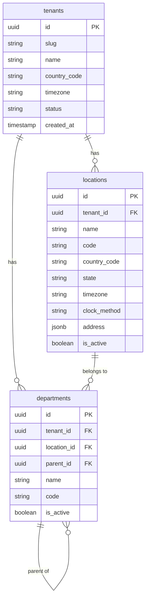

# ERD: Core / Org Structure

This domain defines the foundational organisational hierarchy. A **tenant** represents a single company using the platform (multi-tenant SaaS). Each tenant has one or more **locations** (physical sites, offices, or work areas), and each location (or tenant directly) may have a tree of **departments**. Almost every other table in the system carries a `tenant_id` foreign key that roots it to this hierarchy, and many carry an optional `location_id` or `department_id` as well.

