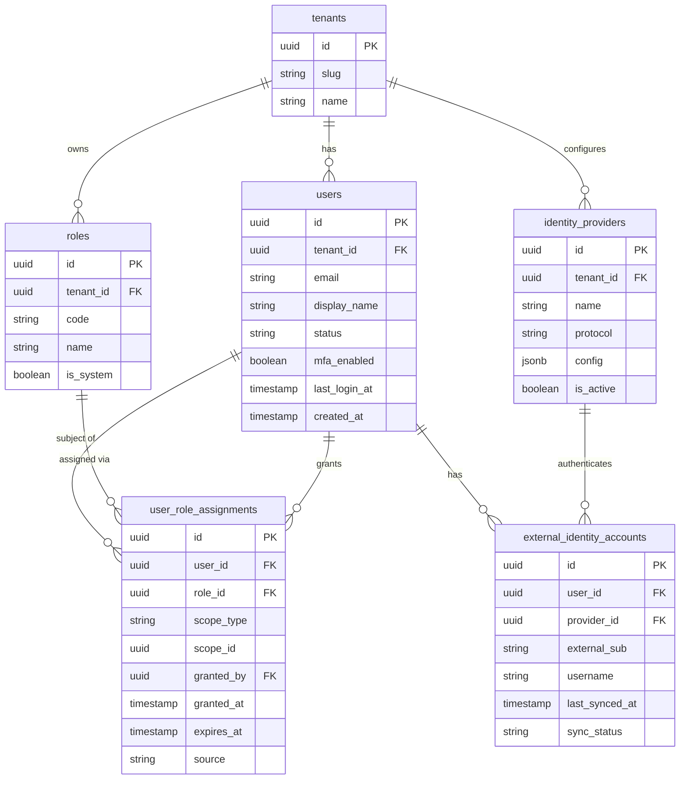

# ERD: Identity / Access

This domain manages who can log in and what they are permitted to do. **Users** are human principals scoped to a tenant. **Roles** may be system-wide (shared across tenants) or tenant-specific, and are assigned to users via **user_role_assignments**, which carry an optional scope (e.g. a specific location or department) and an expiry. Federated login is supported through **identity_providers** (SAML, OIDC, etc.), with each user's external account tracked in **external_identity_accounts**.

