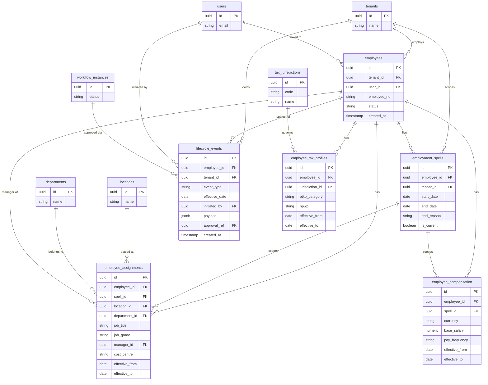

# ERD: Employee / Lifecycle

This domain models the full lifecycle of an employee from hire to separation. An **employee** record links to an optional **user** (system access) and is partitioned into one or more **employment_spells** — contiguous periods of active employment (e.g. original hire, rehire). All position, compensation, and tax data hang off a spell, making it straightforward to model rehires without losing history.

**employee_assignments** and **employee_compensation** are effective-dated: each row carries `effective_from`/`effective_to`, so the full history of role changes, department moves, and pay adjustments is preserved as immutable rows rather than overwrites. **lifecycle_events** capture discrete HR actions (hire, transfer, promotion, termination) and may reference a **workflow_instance** when approval is required.

