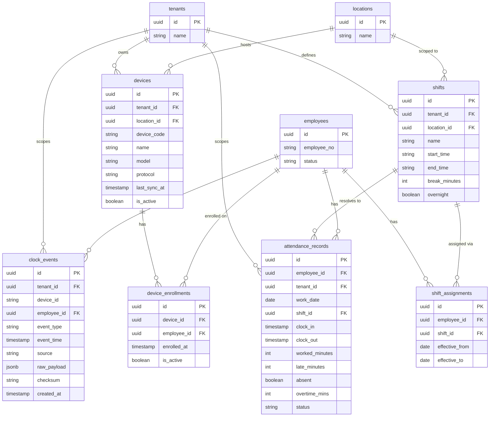

# ERD: Attendance

This domain covers the full attendance pipeline from hardware to processed record. **Devices** (biometric terminals, mobile apps, etc.) are registered per location. Employees are enrolled on specific devices via **device_enrollments**. When an employee clocks in or out the device emits a **clock_event** — a raw, immutable record with a checksum used for integrity verification. A background processing job resolves raw clock events against the employee's active **shift** to produce an **attendance_record** with computed fields such as `worked_minutes`, `late_minutes`, and `overtime_mins`. Both `clock_events` and `attendance_records` are range-partitioned by date for query performance.

