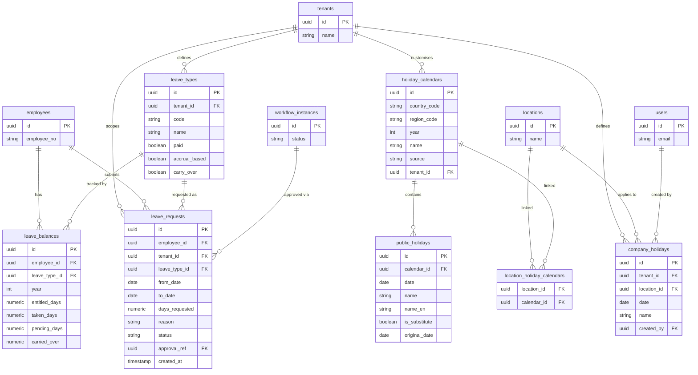

# ERD: Leave

This domain manages employee leave entitlements, requests, and the holiday calendars that determine working days. **leave_types** define the rules for each type of absence (annual leave, sick leave, etc.), including whether it accrues and whether unused days carry over. **leave_balances** track per-employee, per-year entitlement and consumption. When an employee submits a **leave_request** it may be routed through a **workflow_instance** for approval.

Holiday calendars are sourced at the country/region level (**holiday_calendars** and **public_holidays**) and linked to specific locations via the **location_holiday_calendars** junction table. Tenants can also define one-off **company_holidays** (e.g. a company anniversary) that apply globally or to a specific location.

