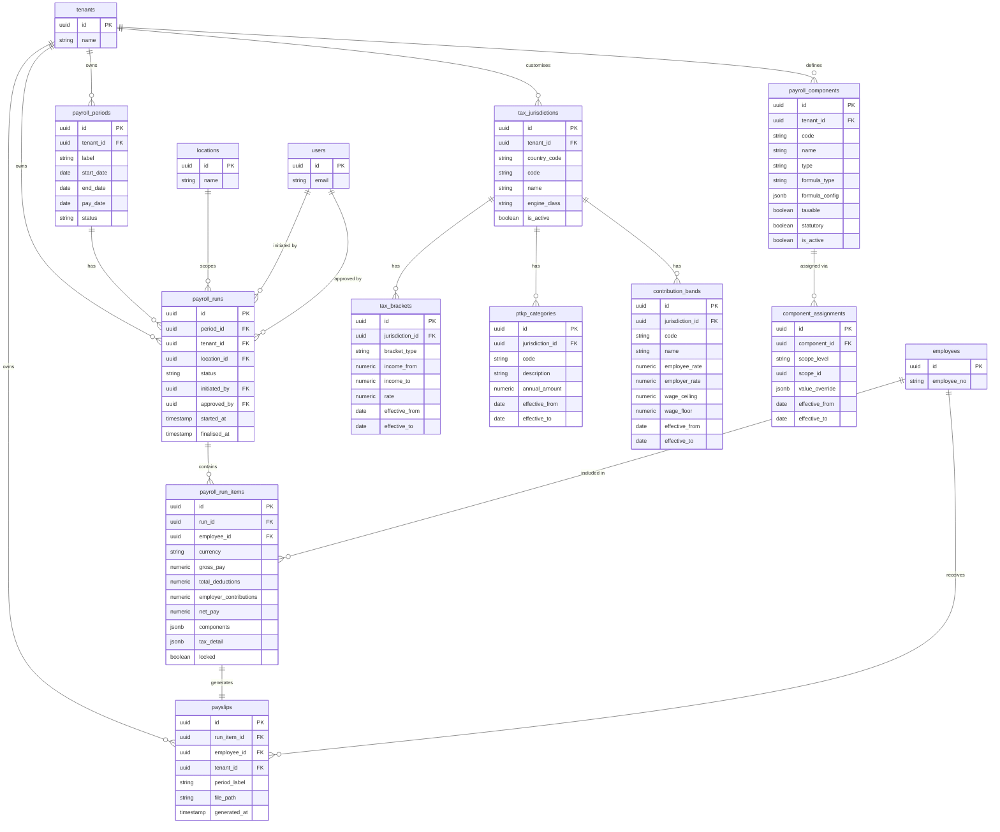

# ERD: Payroll / Tax

This domain covers the full payroll calculation pipeline and the tax reference tables it depends on. A **payroll_period** defines the calendar window (e.g. April 2026). One or more **payroll_runs** are executed against a period — typically one per location or employment type. Each run produces a **payroll_run_item** per employee, storing gross pay, deductions, employer contributions, net pay, and the full component breakdown in JSONB. A **payslip** document is generated from each run item.

Tax calculations draw on four reference tables that are all effective-dated so that annual regulatory changes (new PTKP thresholds, revised brackets, updated contribution rates) can be loaded ahead of time without affecting prior-period recalculations:
- **tax_jurisdictions** identifies the tax engine to invoke (e.g. Indonesia PPh 21, Philippines BIR).
- **tax_brackets** define progressive income tax rates.
- **ptkp_categories** define Indonesian non-taxable income thresholds by marital/dependent status.
- **contribution_bands** define statutory social-security contribution rates and wage ceilings (e.g. BPJS).

**payroll_components** (earnings, deductions, benefits) are configured at tenant level with formula rules, and assigned to employees, departments, or locations via **component_assignments**.

