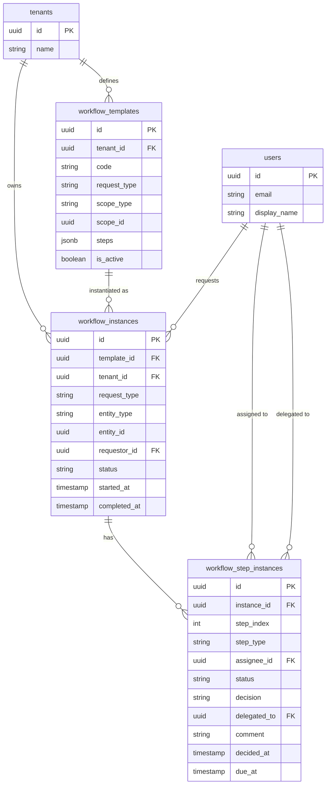

# ERD: Approvals / Workflow

This domain provides a generic multi-step approval engine used by leave requests and lifecycle events. A **workflow_template** defines the approval steps (as JSONB) for a given request type (e.g. `leave_request`, `termination`) and can be scoped to a tenant, location, or department. When a request is submitted, a **workflow_instance** is created from the matching template, capturing the requestor and the entity being approved. Each step in the workflow produces a **workflow_step_instance** record that tracks the assignee, their decision, any delegation, and timestamps.

The `approval_ref` column on `leave_requests` and `lifecycle_events` points back to the relevant `workflow_instances.id`, making it easy to query the full approval trail for any HR action.

