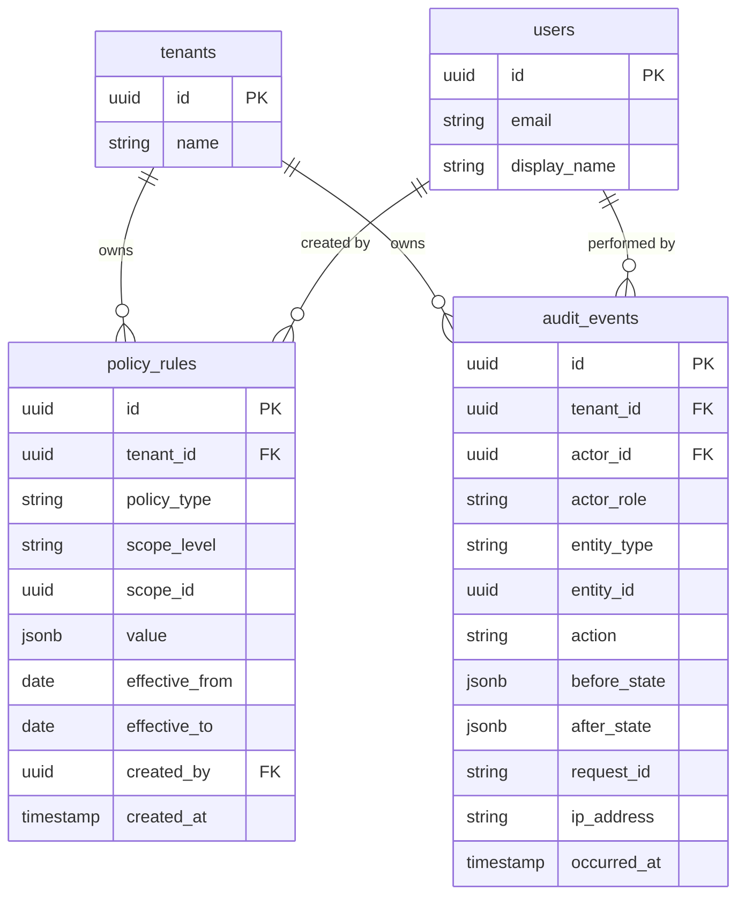

# ERD: Policy / Audit

## Policy

**policy_rules** implement a hierarchical configuration system. Each rule has a `scope_level` (e.g. `tenant`, `location`, `department`, `employee`) and a `scope_id` that identifies the specific entity it applies to. At runtime the policy engine resolves the narrowest matching rule for a given scope, so a department-level rule overrides a tenant-level default. Rules are effective-dated (`effective_from`/`effective_to`), enabling future-dated configuration changes. The `value` column is JSONB and holds the policy payload, which varies by `policy_type` (e.g. overtime thresholds, leave accrual parameters, payroll cut-off rules).

## Audit

**audit_events** is an append-only, immutable log of every significant state change in the system. Each event captures the actor, the entity type and ID affected, the action performed, and a before/after snapshot of the entity state in JSONB. The table is range-partitioned by `occurred_at` for retention management and query performance. No rows are ever updated or deleted from this table.

