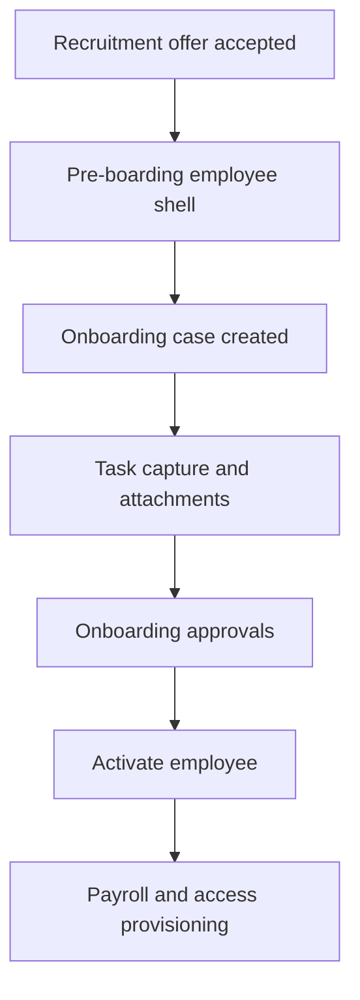

# HRIS Implementation Checklist

Use this checklist as the execution order for `docs/hris-system-plan.md`. Complete each item in sequence unless a dependency is explicitly marked as parallel.

Implementation rule for every phase: keep the work SOLID, with separate responsibilities, dependency inversion through providers or interfaces, and translation/config/data split into dedicated modules instead of mixed inside screen or service classes.

## Release Readiness
Use this section as the launch gate before pilot or public rollout. Complete the steps in order, and use [docs/hris-release-readiness-plan.md](C:\Users\onesa\Documents\Personal\programming\claude\hris-apps\docs\hris-release-readiness-plan.md) for the expanded version.

### Step 1: Lock the pilot scope
- [ ] Choose one tenant, one country, one attendance ingestion path, and one payroll jurisdiction.
- [ ] Freeze the initial role matrix and approval chains for the pilot.
- [ ] Decide which workflows are in scope for launch and which are deferred.

### Step 2: Remove production fallbacks
- [ ] Disable `DEV_AUTH_BYPASS` in non-development environments.
- [ ] Remove silent mock-data fallback behavior from production paths.
- [x] Replace simulated offer approval with real workflow instance creation.

### Step 3: Finish hiring and onboarding
- [x] Make requisition approval use the workflow engine.
- [ ] Make offer acceptance emit `recruitment.offer.accepted` end to end.
- [ ] Verify onboarding case creation, task completion, attachments, approvals, and activation.
- [ ] Confirm activation hooks succeed or fail loudly with audit events.

### Step 4: Finish attendance and leave
- [ ] Validate at least one real device or middleware adapter.
- [ ] Verify clock event ingestion, absence detection, and holiday resolution.
- [x] Confirm leave requests, balances, and approvals behave correctly.

### Step 5: Finish payroll for one jurisdiction
- [ ] Complete statutory calculations and payroll components for the pilot jurisdiction.
- [ ] Generate payslips and verify payroll finalization locks the run.
- [ ] Confirm the payroll output matches the pilot fixtures and audit history.

### Step 6: Prove the system with tests
- [ ] Add E2E flows for onboarding, attendance, leave, approvals, and payroll.
- [x] Add a pilot hiring-to-onboarding flow test that covers authenticated access, requisition approval, offer approval, and onboarding handoff.
- [x] Add a pilot attendance clock-in/clock-out flow test that covers shift setup, assignment, reconciliation, and daily summary.
- [x] Add a pilot leave-request flow test that covers submission, balance reservation, review, and approval.
- [ ] Run integration tests against real PostgreSQL and Redis.
- [ ] Add regression coverage for fallback and simulation paths.
- [ ] Add audit coverage for mutating operations in the pilot scope.

### Step 7: Harden operations
- [ ] Prove backup and restore in a clean environment.
- [ ] Verify migration and rollback procedures.
- [ ] Add health checks and smoke checks for the full stack.
- [ ] Add actionable logging or alerting for failed jobs and domain events.

### Step 8: Finish public-launch hardening
- [ ] Complete directory sync and external identity linkage.
- [ ] Finish delegation, escalation, and conditional routing.
- [ ] Add audit search and export, reporting, and deployment packaging.
- [ ] Verify upgrade and rollback on a staged environment.

## Phase 0: Project Setup
- [ ] Confirm the first release scope and jurisdictions.
- [ ] Confirm tenant model, initial roles, and required biometric vendors.
- [ ] Confirm delivery model for client-hosted portable installation.
- [x] Initialize pnpm workspace with Turborepo config.
- [x] Scaffold `apps/api` (NestJS), `apps/web` (Next.js), `packages/types`, `packages/db`, `packages/config`.
- [x] Create repo structure for app, API, workers, shared libs, docs, and tests.
- [x] Set up local development environment and environment variables.
- [x] Set up Docker Compose local dev stack (postgres, redis, api, web, worker).
- [x] Set up Drizzle ORM schema and migration toolchain (drizzle-kit).
- [x] Define Phase 0 backend defaults for module boundaries, auth/tenant model, first entities, and API conventions.
- [x] Add ADR folder and documentation convention.
- [x] Review Aurora UI/UX handoff and capture the desktop/mobile design system.
- [x] Add ADR 007 consolidating the Phase 0 backend defaults and Aurora UI/UX design.
- [x] Add Phase 0 learning docs for project setup and implementation references.
- [x] Implement the Aurora responsive web shell for Dashboard, People, Leave, and Approvals.
- [x] Extract the People screen into its own frontend feature module.
- [x] Enable the People "Add Employee" modal interaction.
- [x] Enable the People "Edit Employee" modal interaction.
- [x] Enable the People suspend and delete employee flow.
- [x] Extract the Dashboard screen into its own frontend feature module.
- [x] Move shared shell data into a dedicated module to keep `AuroraApp` focused on orchestration.
- [x] Extract the Leave screen into its own frontend feature module.
- [x] Enable the Leave "Apply Leave" modal interaction.
- [x] Extract the Organization screen into its own frontend feature module.
- [x] Extract the Approvals screen into its own frontend feature module.
- [x] Move the Dashboard and Approvals screens to dedicated locale helpers.
- [x] Extract the Attendance screen into its own frontend feature module.
- [x] Extract the Reports screen into its own frontend feature module.
- [x] Extract the Recruitment screen into its own frontend feature module.
- [x] Enable the Recruitment "Create Requisition" modal interaction.
- [x] Add edit and delete actions for Recruitment requisitions.
- [x] Extract the Performance screen into its own frontend feature module.
- [x] Enable the Performance "Create Cycle" modal interaction.
- [x] Add a unit test for the Performance review helper.
- [x] Extract the Learning screen into its own frontend feature module.
- [x] Enable the Learning "Enroll Course" modal interaction.
- [x] Add a unit test for the Learning course helper.
- [x] Add an isolated API test harness for the Organization backend module.
- [x] Add a unit test for the People filtering helper.
- [x] Add a unit test for the Organization overview helper.
- [x] Add a unit test for the Approvals queue helper.
- [x] Add a unit test for the Attendance overview helper.
- [x] Add a unit test for the Reports overview helper.
- [x] Add a unit test for the Recruitment overview helper.
- [x] Add EN/ID locale toggle with smooth language transition for the Aurora shell and People screen.
- [x] Add the API health module and versioned `/api/v1` prefix.
- [x] Scaffold the first backend domain module: Organization.
- [x] Configure BullMQ with Redis connection.
- [x] Configure EventEmitter2 module for in-process domain events (ADR 003).
- [x] Set up i18n infrastructure for EN and ID languages (ADR 006).
- [x] Implement global ExceptionFilter with ADR 006 error shape.
- [x] Define API conventions: URL versioning, cursor-based pagination, consistent JSON error format, and OpenAPI generation from backend definitions.
- [x] Create base CI pipeline for lint, typecheck, unit tests, and build.
- [x] Add missing ADRs: policy resolution strategy, workflow engine design, biometric adapter contract, payroll calculation order, identity provider choice, and reporting storage strategy.
- [x] Add ADR 016: ATS and Recruitment data model — full hiring lifecycle from headcount request to onboarding handoff. _(Candidate entity, application join model, interview scorecards, offer approval workflow, and `recruitment.offer.accepted` → employee creation event)_
- [x] Seed Indonesia tax data: initial TER brackets, PTKP categories, and BPJS rates (ADR 004 — required before payroll can run).

## Phase 1: Foundation
- [x] Implement authentication provider integration (Keycloak / OIDC).
    _(Local dev currently includes a temporary auth bypass (`DEV_AUTH_BYPASS=true`) so seeded API data stays visible even when the browser token bridge is unavailable; this is dev-only and must stay off in production.)_
- [ ] Add MFA enforcement for admin, HR, payroll, and security roles. _(Keycloak config — Phase 1b)_
- [ ] Implement short-lived session management and secure cookie handling. _(JWT stateless model in use; revisit if browser sessions needed)_
- [ ] Add anti-CSRF protections for browser-based sessions. _(Not applicable: JWT in Authorization header is not CSRF-vulnerable)_
- [ ] Implement LDAP / Active Directory directory sync and group-to-role mapping. _(Phase 1b — requires customer AD)_
- [ ] Add directory mapping tables and external identity linkage. _(Phase 1b)_
- [ ] Define directory data model and sync event taxonomy. _(Phase 1b)_
- [ ] Implement just-in-time account provisioning and scheduled sync jobs. _(Phase 1b)_
- [ ] Add local permission override and audit tracking for directory-driven access. _(Phase 1b)_
- [ ] Add directory provisioning workflow and role/group mapping examples. _(Phase 1b)_
- [x] Implement tenant model and tenant-aware request context.
- [x] Implement RLS middleware that sets the PostgreSQL `app.tenant_id` session variable on every request. _(Set per-transaction in DatabaseService.withTenantClient via `set_config`)_
- [x] Add row-level security strategy and tenant scoping enforcement. _(0001_enable_rls.sql: policies on all tenant-scoped tables)_
- [x] Create user, role, permission, and menu access models (14 roles per requirements).
- [x] Implement RBAC authorization with role-based guards and scoped role assignments. _(RolesGuard + @Roles() decorator; ABAC location/department scoping deferred to Phase 2)_
- [ ] Add People menu structure for onboarding, lifecycle, and self-service employment actions. _(Frontend — Phase 2)_
- [x] Create organization models for location, department, team, and manager relationships.
- [x] Implement structured logging middleware (structured JSON; required fields: `request_id`, `trace_id`, `tenant_id`, `user_id`, `actor_role`, `module`, `action`, `entity_type`, `entity_id`; no PII).
- [x] Implement policy resolution engine (5-level hierarchy: employee → department → location → company → system default) with resolution path logging.
- [x] Set up BullMQ worker entry point controlled by `RUN_MODE` environment variable (ADR 002).
- [x] Add audit log foundation for all mutating actions (append-only).
- [x] Add sensitive field encryption service (AES-256-GCM, EncryptionService). _(Service ready; field-level application to NPWP/bank/salary deferred to Phase 2 when those entities are built)_

## Phase 2: Employee Core
- [x] Build employee profile model and employment spell model. _(employees + employment_spells tables with RLS)_
- [x] Add effective-dated history for assignments, position, and compensation. _(employment_spells: close current + open new on any change)_
- [x] Implement employee lifecycle event log. _(employee_lifecycle_events: append-only per employee)_
- [x] Define lifecycle event taxonomy for hire, transfer, promotion, resignation, termination, rehire, and secondment. _(lifecycleEventTypeEnum with 9 event types)_
- [x] Define all domain event payload types in `packages/types/src/events/` (ADR 003: `employee.hired`, `employee.transferred`, `employee.promoted`, `employee.resigned`, `employee.terminated`, `employee.rehired`, `employee.seconded`).
- [x] Implement hire, transfer, promotion, resignation, termination, suspend, and rehire records. _(EmployeeService: 10 endpoints on /api/v1/employees)_
- [ ] Add lifecycle event diagram and state machine documentation.
- [x] Link employee tax profile (`employee_tax_profiles`) to the employee creation flow with PTKP category assignment. _(EmployeeService.upsertTaxProfile with NPWP encrypted via AES-256-GCM)_
- [x] Build employee self-service profile screens. _(PeopleScreen wired to real API with graceful mock fallback; create flow now uses organization catalog data instead of placeholder org IDs; transfer, promote, resign, and history controls are now available in the UI)_
- [ ] Add import/export for employee records. _(Deferred — no urgent need until real data exists)_
- [x] Implement Keycloak OIDC login for the frontend (NextAuth + Keycloak provider). _(login page, session middleware, auto-realm import, token wired to API client)_
- [x] Add sensitive field encryption applied to NPWP and bank account numbers at rest. _(EncryptionService applied in upsertTaxProfile + addBankAccount)_
- [x] Fix People module status model: replace Approved/Rejected with Terminated/Pre_Boarding; add manager_id column (migration 0004); wire direct-manager picker in create/edit form; show manager name on employee row. _(Terminated employees stay visible under Terminated filter instead of disappearing; lifecycle action buttons hidden for terminated employees)_

### People module gaps — tracked for future sprints
- [ ] Add full employee profile screen: personal details (home address, date of birth, gender, nationality), emergency contact, identity documents (NIK, KTP, passport), NPWP editable in UI, BPJS registration numbers. _(Currently only name/role/dept/location are editable)_
- [x] Add employment contract details to create/edit form: contract type (PKWTT/PKWT/Magang/Part-time), probation end date, notice period days, job grade/band. _(Migration 0005 adds columns to employment_spells; fields surfaced in create/edit dialog)_
- [ ] Add employee self-service view: employee logs in and sees only their own profile, payslips, and leave balance; can update personal info and bank account. _(Currently the People screen is HR-admin only with no role-based data scoping)_
- [x] Add Rehire action to the People screen UI. _(POST /employees/:id/rehire backend + lifecycle dialog form + row button — shown only for Terminated employees)_
- [x] Add Secondment action to the People screen UI. _(POST /employees/:id/secondment backend + lifecycle dialog form + row button — shown for active employees)_
- [ ] Implement role-based scoping on the People list: managers see only their direct reports; employees cannot access the People screen at all. _(Currently all authenticated users see all employees)_
- [ ] Add profile photo upload to the employee profile. _(Stored in object storage; displayed as avatar replacing the initials placeholder)_

## Phase 3: Hiring and Onboarding
- Phase 3 is the active onboarding delivery phase. The full employee path is being built here in order: pre-boarding employee shell, onboarding case, task capture and attachments, approval routing, activation, then payroll and access provisioning hooks.
- Done so far: hire case/onboarding tables, onboarding task engine, task capture, file attachments, state transitions, cancellation/hold/reactivation, and the People onboarding modal.
- Done for this branch: recruitment handoff contract hardening, onboarding approvals, activation hooks, and the full onboarding-to-activation flow.
- Later follow-up: the ATS producer wiring that emits `recruitment.offer.accepted` end to end, plus any remaining external integration hardening for payroll/access sync and final onboarding UX polish.

- [x] Add `hire_cases` and `onboarding_tasks` database schema.
- [x] Implement recruitment handoff into onboarding. _(Onboarding listener subscribes to `recruitment.offer.accepted`, accepts a discriminated handoff payload with either `employeeId` or `employeeShell`, can create the pre-boarding employee shell from offer data when needed, creates the onboarding case, and exposes employee-level lookup for the People onboarding modal/row action.)_
- [x] Add hire case and onboarding case tables.
- [x] Implement onboarding task engine.
- [x] Add onboarding workflow approvals. _(Task completion now enforces task assignee routing by actor role; activation transitions are in place.)_
- [x] Add document upload and policy acknowledgement capture. _(Task capture modal now records structured document details and policy acknowledgement notes on onboarding completion; file upload/storage is implemented with onboarding attachment records and a storage adapter that supports local filesystem in dev and S3-compatible object storage in production.)_
- [x] Add payroll and access provisioning hooks on activation. _(Payroll setup now has a real downstream consumer: the activation hook initializes the employee tax profile from onboarding payroll data, falls back to the default PTKP category `TK/0` when payroll details are missing, and emits `payroll.setup.initialized` / `payroll.setup.failed` events only for real failures. Access provisioning now has a real local consumer too: it links or creates the app user, grants the employee role, and emits `onboarding.access.provisioned` / `onboarding.access.provisioning.failed` events. Attendance profile initialization now also has a real consumer: it creates the employee attendance profile from the current department, location, timezone, and location clocking method, or emits a failure event when the prerequisites are missing.)_
- [x] Add onboarding state machine and status transitions.
- [x] Add onboarding workflow diagram and approval path documentation. _(See the Phase 3 Mermaid flow above for the current end-to-end onboarding path.)_
- [x] Add support for onboarding cancellation, hold, and reactivation scenarios.
- [x] Add People onboarding modal and row action for pre-boarding employees. _(Create, load, task completion, structured task capture, hold/reactivate/cancel, and activation are wired through the backend onboarding API.)_
    _(Local smoke testing path: seed or bootstrap a `Pre_Boarding` employee and verify the People screen can show real DB rows once the API is reachable.)_

## Phase 4: Attendance and Leave
- [x] Implement location-specific attendance policies. _(attendance_policies table with JSONB rules: grace, absent threshold, overtime limits, working days, break deduction; GET/PUT /attendance/policies; seeded default for Head Office; migration 0009; location-scoped policy rows enforced via RLS)_
- [x] Add shift patterns, shift assignments, and shift rosters. _(POST /attendance/shifts for CRUD; POST /attendance/shift-assignments for assignment; GET current shift per employee; `shifts`, `shift_assignments`, `shift_patterns`, `shift_pattern_slots` in migration 0009)_
- [x] Build clock event ingestion API. _(POST /attendance/clock with automatic attendance_record upsert, worked_minutes calculation on clock-out, raw_payload JSONB storage)_
- [x] Add biometric adapter framework supporting all required ingestion protocols: webhook push, polling, database-polling, file-drop, and MQTT. _(Five adapter classes in `apps/api/src/modules/attendance/biometric/`; `BiometricIngestionService` handles dedup + RLS-aware write)_
- [x] Implement device registration and management (`devices` table). _(`biometric_devices` table in migration 0011)_
- [x] Implement device-to-employee enrollment (`device_enrollments` table). _(`device_enrollments` table in migration 0011)_
- [x] Add raw clock event payload storage for audit and replay. _(`raw_clock_payloads` table in migration 0011; `BiometricIngestionService` stores raw JSON before processing; raw_payload JSONB column on clock_events)_
- [x] Implement deduplication and offline sync handling. _(`BiometricIngestionService.isDuplicate` checks ±2-minute window; `is_duplicate` flag on `clock_events`; ConflictException thrown on duplicate same-direction events)_
- [x] Build absence detection jobs. _(`AbsenceDetectionJob` BullMQ processor in `absence-detection.job.ts`; skips weekends and holiday dates)_
- [x] Seed Indonesia national public holidays for the current year (ADR 005 — required before leave and attendance calculations are correct). _(20 holidays seeded for 2026 including cuti bersama; system calendar ID = cc000000-...-000000002026; also seeded in migration 0010)_
- [x] Implement holiday calendar data model (`holiday_calendars`, `public_holidays`, `location_holiday_calendars`, `company_holidays`). _(Drizzle schema in holiday.schema.ts + SQL in dev-bootstrap.sql; Migration 0010; RLS enabled for tenant-scoped tables)_
- [x] Implement holiday calendar assignment to locations (ADR 005). _(POST /holidays/locations/:locationId/calendar + GET; `location_holiday_calendars` table + `effective_from`/`effective_to` range; dev tenant Head Office auto-assigned to ID 2026 calendar)_
- [x] Add company holiday management in HR admin UI (ADR 005). _(`HolidayPanel` component: year navigation, merged public+company list, add/delete company holidays via `holiday-api.ts`; `HolidayController` REST endpoints guarded by `hr_manager`/`hris_admin` roles; tab switcher added to `AttendanceScreen`)_
- [x] Implement "is this date a holiday?" resolution with company holidays taking priority over public holidays (ADR 005). _(`HolidayService.isHoliday` and `getHolidaysInRange` — company overrides checked first; GET /holidays/resolve and GET /holidays/range exported for leave/attendance/payroll modules)_
- [x] Implement leave balances, accruals, and leave approvals. _(LeaveAccrualService: annual bulk accrual with carry-over + proration for mid-year hires; `LeaveAccrualJob` BullMQ processor; `SubmitLeaveRequestUseCase` creates a `workflow_instance` when leave type requires approval; frontend balances wired to live API; Approve/Decline buttons call `reviewLeaveRequest()`)_

## Phase 5: Workflow and Approvals
- [x] Build workflow template model. _(workflow_templates schema + approval module schema contracts)_
- [x] Build workflow instance and step instance model. _(workflow_instances and workflow_step_instances schema + repository adapters)_
- [x] Add approval resolution logic for manager, HR, plant, and payroll routes. _(approval workflow helper + decision use case)_
- [ ] Add delegation and escalation handling. _(Delegation flow is implemented; escalation scheduler and timeout processing are still pending.)_
- [ ] Add conditional steps and skip-duplicate approver rules. _(Duplicate-approver skipping is implemented; condition evaluation is still pending.)_
- [x] Emit domain events from approval step completion (ADR 003: `approval.step.completed` event consumed by the notification module). _(approval decision use case returns domain events; event contract is published in `packages/types`.)_
- [x] Implement `GET /api/v1/workflow-instances/:id/timeline` endpoint — merge template steps + executed step instances into a single chronological DTO (ADR 015). _(status values: approved, skipped, pending, escalated, rejected, upcoming; include slaBreached flag)_
- [x] Build `<WorkflowTimeline instanceId={instanceId} />` reusable frontend component — vertical stepper with per-status visual coding: green approved, grey skipped, blue pulsating pending, orange escalated, red rejected, grey upcoming (ADR 015).
- [ ] Embed WorkflowTimeline in the Leave Request Details modal (ADR 015).
- [ ] Embed WorkflowTimeline in Employee Lifecycle Change pages: Transfers, Promotions, Terminations (ADR 015).

## Phase 6: Payroll and Tax
- [x] Create payroll period and payroll run models. _(payroll_periods and payroll_runs schema + repository adapters)_
- [ ] Set up jurisdiction engine infrastructure: engine interface, engine registry, and pluggable calculation pipeline (ADR 004). _(Calculation pipeline helpers and vertical slices are in place; engine registry/adapters still pending.)_
- [ ] Build payroll component catalog: earnings, deductions, and employer contributions with formula types (`fixed`, `pct_of_basic`, `per_shift_day`, `table_lookup`) (ADR 004).
- [ ] Implement component assignment scoping using the 5-level policy hierarchy (employee / department / location / company).
- [ ] Seed and protect statutory components (PPh 21, BPJS) from deletion through the UI.
- [ ] Implement overtime calculation engine.
- [ ] Implement attendance deduction engine.
- [ ] Implement Indonesia BPJS contribution engine reading rates from the `contribution_bands` table (ADR 004).
- [ ] Implement Indonesia PPh 21 TER engine reading brackets from the `tax_brackets` table (ADR 004).
- [ ] Implement employee PTKP category management linked to the `ptkp_categories` table (ADR 004).
- [ ] Build admin UI for annual tax table updates — inserting new rows into `tax_brackets`, `ptkp_categories`, and `contribution_bands` so annual government changes are data operations, not code deployments.
- [ ] Add payroll component and payroll policy configuration UI for HR admins.
- [ ] Add payslip generation. _(payslip table exists; generation worker / endpoint still pending.)_
- [ ] Add payroll approval and finalization (lock run items after final approval). _(Run finalisation and item locking are implemented; dedicated payroll approval orchestration is still pending.)_

## Phase 7: Reporting, Compliance, and Integration
- [ ] Build standard reports and dashboards.
- [ ] Add audit search and audit export.
- [ ] Implement privacy workflows for export, erasure, and anonymization.
- [ ] Add notification service for workflow and payroll events.
- [ ] Add integration logs, retries, and dead-letter handling.
- [ ] Add directory sync monitoring, reconciliation, and failure handling.
- [ ] Implement rate limiting and API key management for external API consumers.
- [ ] Add external API versioning and SDK generation.
- [ ] Implement product license key validation (offline RSA-signed key and optional online license server with grace period).
- [ ] Build Docker multi-stage production image with JS obfuscation step (source code stripped from runtime image).
- [ ] Package portable client-hosted release artifacts and installation bundle.
- [ ] Define client-hosted deployment topology and dependency layout.
- [ ] Implement install-time bootstrap for config, secrets, database, cache, and storage.
- [ ] Add license activation and offline license handling.
- [ ] Add signed image or binary verification in the install flow.
- [ ] Add offline install and upgrade path validation.
- [ ] Add backup, restore, and rollback scripts for client-managed installs.
- [ ] Document two-server split topology for customers who outgrow a single server (move postgres and redis to a dedicated DB server; update `DATABASE_URL` and `REDIS_URL` in `.env`).
- [ ] Add smoke-check and health-check automation for installer completion.

## Phase 8: Testing and Release Readiness
- [ ] Add unit tests for policy resolution, approvals, attendance, payroll, and tax.
- [ ] Add Indonesia PPh 21 TER calculation accuracy tests against known government tax fixtures (ADR 004).
- [ ] Add BPJS contribution calculation tests for all 5 components (ADR 004).
- [ ] Add policy resolution hierarchy tests: verify all 5 levels, confirm the correct level wins, and confirm the resolution path is logged (ADR on policy resolution).
- [ ] Add domain event emission and handler tests (ADR 003).
- [ ] Add i18n error message tests — EN and ID for all ADR 006 error codes.
- [ ] Add integration tests against real PostgreSQL and Redis.
- [ ] Add E2E flows for onboarding, attendance, leave, approvals, and payroll.
- [ ] Add security checks for secrets, dependencies, and SAST.
- [ ] Add performance tests for payroll batches and attendance ingestion.
- [ ] Add audit reconciliation tests.
- [ ] Verify portable deployment installation in a clean client-hosted environment.
- [ ] Verify license activation and environment-specific configuration.
- [ ] Verify upgrade and rollback procedure on a staged client-hosted bundle.
- [ ] Confirm production rollback and migration strategy.

## Phase 9: Talent, Performance, and Learning

### 9a — Recruitment / ATS (ADR 016)
- [x] Add ADR 016 ATS database schema migration: `job_requisitions`, `candidates`, `job_applications`, `application_stage_log`, `interviews`, `interview_interviewers`, `interview_scorecards`, `scorecard_templates`, `scorecard_criteria`, `interview_scorecard_ratings`, `job_offers`. _(Enable RLS on all tables; add tenant_id FK to every table)_
- [x] Implement RequisitionService: create/update/submit-for-approval requisition; emit `recruitment.requisition.opened` on status → `open`. _(Approval chain reuses workflow engine from Phase 5; ADR 016)_
- [x] Implement CandidateService: create candidate with duplicate detection on email per tenant; support anonymisation on privacy request (`anonymised_at` + null PII fields). _(ADR 016)_
- [x] Implement ApplicationService: link candidate to requisition; advance stage with `application_stage_log` entry on each transition; emit `recruitment.application.stage_changed`. _(ADR 016)_
- [x] Implement InterviewService: schedule rounds, assign interviewers, submit and read scorecards per interviewer; compute `overall_recommendation` when all scorecards submitted. _(ADR 016)_
- [x] Implement OfferService: create offer draft, submit for approval via workflow engine, mark sent/accepted/declined; emit `recruitment.offer.accepted` on acceptance. _(ADR 016)_
- [x] Implement OnboardingHandlerService: subscribe to `recruitment.offer.accepted`; create `employees` row (`status = pre_boarding`) pre-populated from candidate + offer; create `onboarding_cases` row; increment `job_requisitions.filled_count`. _(ADR 016 onboarding handoff)_
- [x] Wire recruitment frontend to real API: replace mock `recruitment-data.ts` with API calls; add requisition detail view, application kanban, candidate profile drawer, interview scheduling modal, scorecard form, and offer form. _(ADR 016 frontend screens)_
- [x] Embed `<WorkflowTimeline />` (ADR 015) in the offer approval view and requisition approval view.

### 9b — Performance Management
- [ ] Implement Performance Management: review cycles, goal tracking, and rating capture.

### 9c — Learning and Development
- [ ] Implement Learning and Development: course catalog, enrollments, and certification tracking.

### 9d — Reporting
- [ ] Add performance and learning reporting.

## Phase 10: AI and Intelligence Layer (ADR 014)

### Phase 10a — LLM APIs for Text and NLP (Low Risk, High Visibility)
- [ ] Create `ai-service` NestJS module with a pluggable LLM provider wrapper (prompt construction, API rate limiting, PII sanitization before any data leaves the system). _(Support OpenAI, Anthropic, and Google Gemini as swappable providers via a single interface)_
- [ ] Implement resume parser endpoint: accept a document upload, extract structured candidate data (name, skills, experience, education) via LLM, and return a structured JSON payload for the ATS module. _(ADR 014 — Phase 10a)_
- [ ] Implement candidate scoring: given a job description and a parsed resume, return a match score and a list of gap reasons. _(ADR 014 — Phase 10a)_
- [ ] Implement Performance Review draft generation: synthesize attendance data, goal completion, and 360-degree feedback inputs into a draft review narrative for the manager to edit. _(ADR 014 — Phase 10a)_
- [ ] Add AI provider configuration to tenant settings: allow per-tenant selection of provider (OpenAI / Anthropic / Gemini / self-hosted) and API key storage (encrypted at rest). _(ADR 014 — Phase 10a)_

### Phase 10b — RAG Policy Chatbot (Medium Complexity)
- [ ] Enable `pgvector` extension in PostgreSQL and add an `ai_policy_embeddings` table for storing document chunk embeddings. _(ADR 014 — Phase 10b)_
- [ ] Build an embedding ingestion pipeline: when a policy document is saved, chunk the text, generate embeddings via the configured LLM provider, and store them in `ai_policy_embeddings` scoped by tenant + location + department. _(ADR 014 — Phase 10b)_
- [ ] Implement the policy chatbot orchestration endpoint: resolve the user's context (location, department, role) → vector search for relevant policy chunks → construct a grounded prompt → return LLM answer with source citations. _(ADR 014 — Phase 10b; integrates with ADR 008 policy resolution hierarchy)_
- [ ] Add a chat UI widget to the Aurora shell: floating chat button opens a slide-over panel, supports multi-turn conversation history per session. _(ADR 014 — Phase 10b)_

### Phase 10c — Payroll Anomaly Detection (High Value, Internal)
- [ ] Implement a payroll anomaly detection engine: after each payroll calculation batch, run Z-score analysis per employee against their last 6 months of run items; flag items where `|z| > 3` as anomalies. _(ADR 014 — Phase 10c; hooks into PayrollFinalizationEvent)_
- [ ] Surface anomaly flags in the Payroll Review UI: show a warning badge per flagged run item with the deviation reason before HR confirms finalization. _(ADR 014 — Phase 10c)_
- [ ] Add an ML upgrade path for anomaly detection: export anonymized payroll telemetry to a separate `analytics_snapshots` table for future Isolation Forest model training. _(ADR 014 — Phase 10c; data preparation only, no ML model in this step)_

### Phase 10d — Predictive Analytics (High Complexity)
- [ ] Implement employee flight-risk scoring: BullMQ weekly job reads anonymized behavioral signals (salary stagnation months, partial-absence frequency, performance trend) and writes a `flight_risk_score` (0–100) back to the employee record. _(ADR 014 — Phase 10d)_
- [ ] Surface flight-risk scores in the People screen: show a risk indicator on employee cards visible to HR Manager and above roles only. _(ADR 014 — Phase 10d)_
- [ ] Implement smart shift roster generation: given approved leaves, legal hour constraints, and historical production-demand patterns, auto-generate a draft weekly roster for a shift supervisor to review and publish. _(ADR 014 — Phase 10d)_

## Phase 11: Product Enhancements and Market Differentiators

Implementation priority is marked on each item: **[First]** = do next (zero cost, high ROI), **[Next]** = second wave, **[Later]** = has dependency or ongoing cost.

### 11a — Zero-Cost Quick Wins (Next Branch: `feature-phase-11a-quick-wins`)

> **Planned as the next development sprint.** All four items below are zero ongoing cost, build on existing DB data, and are the strongest demo/sales features available at this stage.

- [ ] **[First — Point 1]** Implement interactive Org Chart screen: render the department/team/manager hierarchy from existing org data using a free tree-layout library; support click-to-drill-down, search by name, and filter by location or department. _(No third-party cost; data already in DB)_
- [ ] **[First — Point 2]** Implement White-Labeling / custom branding per tenant: store `logo_url`, `primary_color`, `app_name`, and `custom_domain` in the tenants table; apply via CSS custom properties at shell boot so each tenant sees their own brand. _(No ongoing cost; opens reseller channel)_
- [ ] **[First — Point 3]** Implement GPS Geofencing clock-in: use the browser `navigator.geolocation` API to capture the employee's coordinates at clock-in and reject the request if outside the configured radius for the location; store `lat`, `lng`, and `accuracy_meters` on the clock event for audit. _(No map API cost — radius check is pure Haversine math on the backend)_
- [ ] **[First — Point 4]** Implement Indonesian Government Report auto-generation — SPT Masa PPh 21: generate the DJP e-Filing CSV (format per PER-14/PJ/2013 and eSPT PPh 21 schema) from payroll run data; allow HR to download and upload directly to djponline.pajak.go.id. _(No third-party cost; format is publicly documented by DJP)_
- [ ] **[First — Point 4]** Implement Indonesian Government Report — BPJS Ketenagakerjaan monthly report: generate the SIPP Online Excel upload template (JHT + JP + JKK + JKM contribution columns) from payroll run data. _(Format is the downloadable BPJS template from sipp.bpjsketenagakerjaan.go.id)_
- [ ] **[First — Point 4]** Implement Indonesian Government Report — BPJS Kesehatan monthly report: generate the EDABU Excel upload template (employee + employer health contribution columns) from payroll run data. _(Format from edabu.bpjs-kesehatan.go.id)_
- [ ] **[First — Point 4]** Implement Indonesian Government Report — Wajib Lapor Ketenagakerjaan Online (WLKP): generate the annual manpower report (employee count by gender, age, education, job type) in the format required by wajiblapor.kemnaker.go.id. _(Required annually under UU No. 7 Tahun 1981)_
- [ ] **[First — Point 4]** Add a Government Reports screen in the HR admin UI: period picker → preview → download button for each report type; show last-generated timestamp and a direct link to the relevant government portal. _(No cost; pure frontend on top of the generation endpoints)_
- [ ] **[First — Point 5]** Build Visual Workflow Designer: ordered-list drag-drop editor (dnd-kit, MIT) for HR admins to create and edit `workflow_templates` without code — add step, pick approver type (manager / HR / payroll / plant / specific person) from a dropdown, set preset skip condition (never / no salary change / duplicate approver / below grade), set SLA in days. Backend CRUD endpoints for `workflow_templates` + `workflow_step_definitions`. _(No license cost; ~3.5 days; canvas/DAG editor deferred to Phase 5 when parallel approvals are introduced)_

### 11b — Zero-Cost Second Wave
- [ ] **[Next]** Implement Custom Employee Fields: `employee_custom_fields` definition table (field_name, field_type, required, display_order) + `employee_custom_values` EAV table; expose field management in HR admin settings and render custom fields on the employee create/edit forms. _(No third-party cost; reduces implementation consulting for every enterprise client)_
- [ ] **[Next]** Implement Pulse Surveys / eNPS: `survey_templates`, `survey_questions`, and `survey_responses` tables; allow HR to send a recurring survey to all or filtered employees; render results as NPS score + distribution chart in the Dashboard. _(No third-party cost; response data feeds ADR 014 Phase 10d flight-risk scoring)_
- [ ] **[Next]** Implement Expense Management module: employee submits a claim (category, amount, receipt upload, project code) → approval workflow → approved amount added to next payroll run as a reimbursement line item. Reuses approval engine, payroll component system, and Phase 3 document upload. _(No third-party cost)_

### 11c — Low-Cost / Free-Tier External Services

- [ ] **[Next]** Implement WhatsApp Bot integration via Meta Cloud API (free tier: 1,000 service conversations/month): employees can check leave balance, submit leave requests, view payslip summary, and receive approval status updates via WhatsApp. _(Requires a verified Meta Business account — free to register. Cost beyond free tier ~$0.05–0.08/conversation, passable to client)_

### 11d — Has Third-Party Cost or Partnership Dependency

- [ ] **[Later]** Implement E-Signature integration for HR documents (employment contracts, policy acknowledgements, payslips): integrate with Privy.id (most widely adopted in Indonesia) as the primary provider and PeruriSign (government-backed) as an alternative; store signed document hash and timestamp for audit compliance under UU ITE. _(Per-signature fee ~Rp 2,000–5,000; pass-through to client per document)_
- [ ] **[Later]** Implement Earned Wage Access (EWA / On-Demand Pay): expose a daily-accrued-earnings endpoint; integrate with an EWA financial partner (GajiGesa or Wagely) who fronts the cash and recovers it at payroll cutoff; the employer pays zero; the employee pays a small transaction fee to the EWA provider. _(Your cost = integration dev time only; requires a signed partnership agreement with the EWA provider)_
- [ ] **[Later]** Implement ASEAN multi-jurisdiction payroll — Malaysia: add EPF (11% employee / 13% employer), SOCSO, and EIS contribution engines following the same jurisdiction-pluggable pattern as ADR 004; add MY tax bracket table seeding. _(No API cost; pure dev time — start this when you have a Malaysian client prospect)_
- [ ] **[Later]** Implement ASEAN multi-jurisdiction payroll — Philippines: add SSS, PhilHealth, and Pag-IBIG contribution engines; add PH income tax table seeding (TRAIN Law brackets). _(Same pattern as Malaysia above)_
- [ ] **[Later]** Implement ASEAN multi-jurisdiction payroll — Singapore: add CPF contribution engine (employee + employer bands by age group); add SG progressive income tax table seeding. _(Same pattern; CPF rate table is publicly published by CPF Board)_

- [ ] Core modules are usable end to end.
- [ ] Payroll can run for at least one jurisdiction with correct tax calculations.
- [ ] Attendance events can be ingested from at least one device or middleware adapter.
- [ ] Approvals work for hire, transfer, promotion, resignation, and leave.
- [ ] Audit and privacy requirements are in place.
- [ ] Documentation is updated for all implemented modules.
