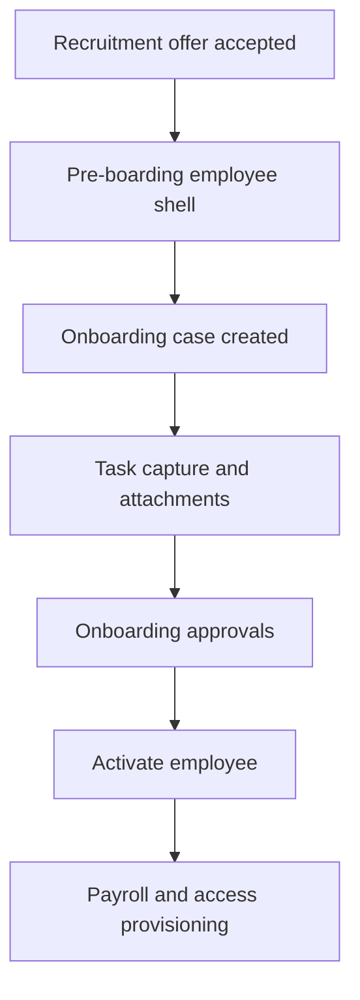

# HRIS System Planning Document

## Summary
Build a multi-tenant HRIS for companies with multiple plants, departments, and work locations. The system should be configurable by HR admins through the UI, support plant-specific rules for attendance, overtime, leave, approvals, and payroll, and integrate with third-party biometric/fingerprint systems for attendance verification. Payroll must include tax and statutory contribution calculations per jurisdiction.

## Goals
- Provide a single HR platform for employee records, attendance, leave, payroll, approvals, and compliance.
- Support location-specific operations for factories, offices, and hybrid teams within one tenant.
- Make HR rules configurable without code changes.
- Keep payroll, attendance, and approval logic auditable, versioned, and testable.

## Functional Scope
- Employee management
- Leave and attendance management
- Approval workflows
- Biometric device integration
- Overtime calculation
- Payroll processing
- Tax calculation by jurisdiction
- Reporting and analytics
- Performance management
- Recruitment / ATS
- Learning and development
- Audit and compliance tooling

## Domain Model
### Tenant and Organization
- Tenant represents the company boundary.
- Locations represent plants, offices, branches, or remote groups.
- Departments and teams sit under locations.
- Employees can be assigned to one primary location and optionally have temporary reassignment or secondment records.

### Location Requirements
- Location must store timezone, country, state/province, and address.
- Location must support clocking method configuration such as biometric, QR, kiosk, GPS geofence, or manual.
- Location must support public holiday calendars and location-specific attendance rules.

### Policy Hierarchy
Rules should resolve from most specific to least specific:
1. Employee override
2. Department rule
3. Location rule
4. Company default
5. System default

This hierarchy should be used for attendance, overtime, leave, payroll components, and approval routing.

## Key Modules
### Identity and Access
Define how users authenticate, what they can access, and how tenant boundaries are enforced.

### Employee Management
Manage employee profiles, reporting lines, job details, and work location assignments.

### Hiring and Onboarding
Convert selected candidates into active employees through a controlled onboarding process.

### Employee Lifecycle Management
Handle transfers, promotions, resignations, terminations, rehiring, and temporary assignments.

### Attendance
Track clock events, shifts, lateness, absence, and overtime.

### Leave
Manage leave balances, accruals, public holidays, and approvals.

### Workflow and Approvals
Support configurable approval flows for HR requests and operational actions.

### Payroll
Calculate pay, deductions, statutory contributions, and payslips.

### Tax and Statutory
Support jurisdiction-specific tax and contribution rules.

### Integration
Connect to biometric devices and external systems.

### Reporting
Provide standard and custom HR reports and dashboards.

## Product-Level Principles
- Use roles and permissions to control access to menus and actions.
- Keep hiring, onboarding, and employee changes auditable from end to end.
- Make rules configurable per company and per location where needed.
- Preserve historical records for payroll, compliance, and reporting.
- Treat approvals, attendance, and payroll as linked business processes, not isolated screens.

## Delivery Plan
### Phase 1: Core Foundation
- Tenant setup, identity, employee records, location setup, and audit logging
- Basic attendance and leave capability
- Access control and menu scaffolding

### Phase 2: Payroll and Approvals
- Payroll calculation, tax handling, approval workflows, and payslip generation
- Reporting for core HR and payroll operations

### Phase 3: Talent and Learning
- Recruitment, onboarding refinements, performance, and learning features

### Phase 4: Scale and Ecosystem
- Expanded integrations, additional jurisdictions, and enterprise readiness

## Implementation Status
This is a live status snapshot of the current branch so the plan and implementation checklist stay aligned.

### Completed Foundations
- Core auth, tenant scoping, RLS, RBAC, audit logging, structured logging, policy resolution, i18n, and base CI are in place.
- The employee core is implemented: employee profile records, employment spells, lifecycle event logging, tax profile linkage, and encrypted sensitive fields.
- The People screen is wired to the API with a graceful fallback to local mock data when the backend is unavailable, and its create flow now pulls organization catalog data instead of placeholder org IDs. Transfer, promote, resign, and history controls are also present in the UI.
- For local development, the API can temporarily run with `DEV_AUTH_BYPASS=true` so the seeded tenant and pre-boarding employee rows remain visible while we finish hardening the browser token bridge against Keycloak.

### Completed Workflow and Payroll Slices
- The approval workflow backend now has workflow schema tables, assignee resolution helpers, a decision use case, controller adapter, and unit tests.
- Payroll now has period/run schema tables plus the start-run, per-employee calculation, and finalisation slices with repository adapters and tests.
- The first Phase 3 onboarding backbone is in place: hire case and onboarding case tables, onboarding tasks, task completion, onboarding state transitions, and the People onboarding modal / row action / employee lookup bridge are implemented.
- The recruitment-to-onboarding handoff now uses a discriminated event contract so ATS must provide either an existing `employeeId` or a full `employeeShell` when an offer is accepted.
- A typed builder now lives in `packages/types` so future ATS producers can construct the `recruitment.offer.accepted` payload without mixing the two handoff variants.
- Phase 3 onboarding is complete on this branch; the remaining follow-up is the ATS-side producer wiring that emits `recruitment.offer.accepted` end to end, plus any final onboarding UX polish if we decide to revisit the screens.
- Activation now persists a monitored checklist for payroll setup, access provisioning, and attendance profile initialization, with completed/failed statuses surfaced in the UI when required prerequisite data is present or missing. Payroll setup now has a real downstream consumer: it initializes the employee tax profile from onboarding data, falls back to the default PTKP category `TK/0` when needed, and emits success/failure events for future payroll wiring. Access provisioning also has a real local consumer now: it links or creates the app user, grants the employee role, and emits success/failure events for future Keycloak/admin sync wiring. Attendance profile initialization now has a real consumer too: it creates the employee attendance profile from department, location, timezone, and clocking method, with an explicit failure path if the prerequisites are missing. The remaining work is deeper external integration wiring and the ATS payload refinement, not the activation hook itself.

### Still Open
- Employee lifecycle docs such as the state machine diagram and import/export support.
- Onboarding workflow approvals and document / policy capture are in place; the listener and employee-level onboarding lookup are wired, the onboarding task completion flow enforces assignee-role routing, the task capture modal records structured document details and policy acknowledgement notes, and file upload storage is implemented with onboarding attachment rows plus a storage adapter that uses local filesystem in development and S3-compatible object storage in production. Activation now records a monitored hook checklist for payroll setup, access provisioning, and attendance initialization, and emits hook execution events for the real downstream consumers already wired on this branch; the remaining onboarding work is deeper external integration hardening and final documentation polish.
- Workflow escalation, conditional routing, and any dedicated payroll approval orchestration beyond run finalisation.
- Full statutory payroll engines, component catalog, payslip generation, and payroll admin UI.
- Local dev verification currently relies on a seeded `Pre_Boarding` employee and the temporary auth bypass mentioned above; production auth remains Keycloak-backed.

## Test Strategy
- Validate core HR workflows end to end.
- Confirm payroll and attendance calculations are correct.
- Verify role-based access and approvals.
- Check reporting, auditability, and historical record integrity.

## Open Questions to Resolve Early
- Which countries and tax jurisdictions are in scope for the first release?
- Which biometric vendors or middleware products must be supported first?
- Will payroll be launched for salaried employees only, or also hourly and shift-based workers in v1?
- Which approval chains must be configurable in the first release?
- Should the initial product support one tenant with multiple locations, or fully self-service multi-tenant onboarding from day one?

## Assumptions
- The first release starts as a modular monolith, not microservices.
- Plant and location-specific rules are required from day one.
- Payroll tax calculation is in scope for the system.
- Approval workflows and biometric attendance integration are required in the initial design, even if some adapters are added later.
- The planning document can live at `docs/hris-system-plan.md`.

## Supporting Documents
- Technical requirements: [docs/hris-technical-requirements.md](C:\Users\onesa\Documents\Personal\programming\claude\hris-apps\docs\hris-technical-requirements.md)
- Implementation checklist: [docs/hris-implementation-checklist.md](C:\Users\onesa\Documents\Personal\programming\claude\hris-apps\docs\hris-implementation-checklist.md)
