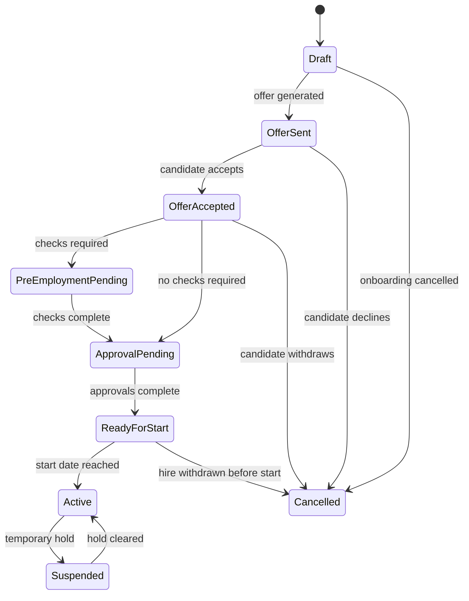
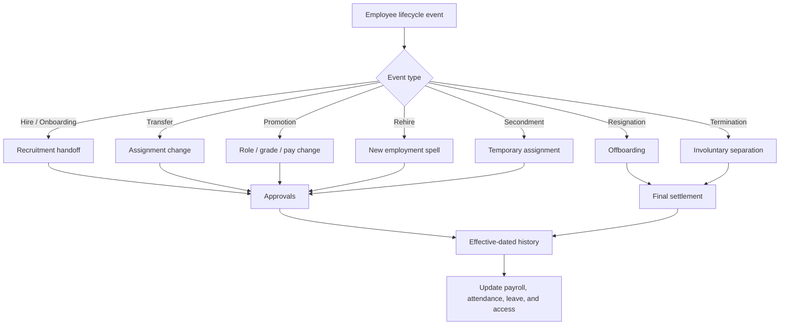
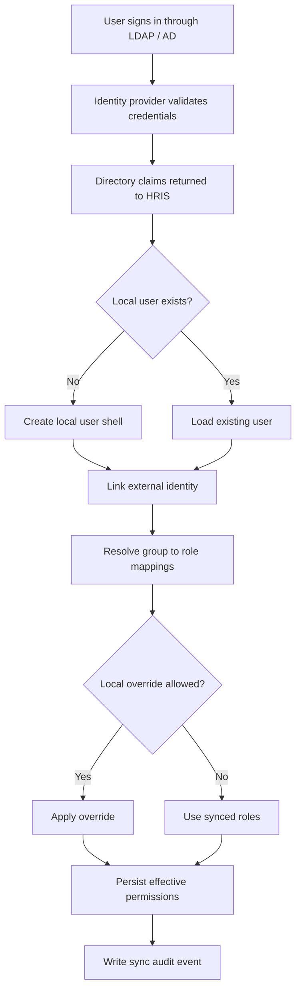

# HRIS Technical Requirements

## Purpose
This document captures implementation-level requirements for the HRIS platform. It complements `docs/hris-system-plan.md`, which stays focused on product and delivery planning.

## Technical Principles
- Build as a modular monolith first.
- Keep bounded contexts clear and independent inside the same codebase.
- Prefer effective-dated history over destructive updates.
- Treat payroll, attendance, approvals, and compliance as auditable workflows.
- Make all tenant, location, department, and employee scope decisions server-enforced.

## Core Modules
- Identity and access control
- Tenant and organization management
- Employee management
- Hiring and onboarding
- Attendance and absence
- Leave management
- Workflow and approvals
- Payroll and statutory calculation
- Tax engine and jurisdiction tables
- Biometric integration
- Reporting and analytics
- Audit and compliance
- Notifications and integrations

## Data and Tenancy Requirements
- Use a shared PostgreSQL database with tenant isolation controls.
- Enforce row-level security in the database.
- Store location, department, and assignment history as effective-dated records.
- Keep payroll and audit records append-only where possible.
- Use UUID identifiers for all core entities.
- Store sensitive fields only in encrypted or masked form where needed.

## Employee Lifecycle State Machine
### Hire / Onboarding State Machine


### Onboarding Technical Rules
- A hire case should not create an active employee until the start date is reached.
- Mandatory tasks must be completed or explicitly waived before activation.
- Payroll, attendance, and access provisioning should be initialized from the effective start date.
- Rehired employees should create a new employment spell while preserving historical records.

### Lifecycle Diagram


### Other Lifecycle Flows
Use the same lifecycle framework for all employment changes, but treat each event type with its own approvals and effective-date handling.

#### Transfer
- Change employee assignment to a new department, location, manager, shift, or cost center.
- Require approvals from source manager, destination manager, and HR when needed.
- Apply the change on an effective date so payroll, attendance, and policies switch cleanly.

#### Promotion
- Update role, grade, title, and compensation in a single effective-dated change.
- Require manager, HR, and payroll approval when pay changes.
- Preserve the previous position and compensation history.

#### Resignation
- Capture employee notice, last working day, and handover requirements.
- Trigger offboarding tasks such as access revocation, asset return, and final settlement.
- Keep the separation record immutable after final approval.

#### Termination
- Support involuntary separation with stricter approval and audit controls.
- Coordinate HR, legal, payroll, and security actions around the effective termination date.
- Immediately revoke access where policy requires it.

#### Rehire
- Create a new employment spell while preserving historical records.
- Reapply onboarding tasks that are still relevant for the return date, role, or location.
- Recalculate policies and payroll eligibility from the rehire effective date.

#### Temporary Assignment / Secondment
- Allow time-bound reassignment to another location, team, or manager.
- Auto-expire the assignment on the configured end date.
- Restore the original assignment automatically unless extended or converted.

### Lifecycle Event Processing Rules
- Every lifecycle event must be effective-dated.
- Historical records must never be rewritten in a way that changes prior payroll or attendance results.
- Lifecycle changes must emit notifications to payroll, attendance, reporting, and approval subsystems.
- Lifecycle transitions should be auditable and reversible only through a new compensating event, not by deleting the original record.

## Workflow Engine Requirements
### Approval Workflow
- Support templates scoped by tenant, location, department, and request type.
- Support sequential and parallel steps.
- Support conditional activation on request fields.
- Support delegation, escalation, and skip-if-same-approver logic.
- Persist workflow instances and step instances separately from the template.

### Onboarding Workflow
Typical workflow steps:
1. Candidate selected in ATS.
2. Offer accepted.
3. Pre-employment checks completed.
4. Hire case created with compensation and assignment data.
5. Manager, HR, and payroll approvals completed.
6. Employee record activated on the start date.
7. Payroll, attendance, leave, and access systems initialized.
8. Onboarding tasks completed.

## Attendance and Biometric Integration
### Attendance Pipeline
1. Ingest clock event from device or middleware.
2. Normalize into internal `ClockEvent`.
3. Deduplicate using event checksum.
4. Resolve employee mapping.
5. Resolve current location and shift policy.
6. Write attendance record.
7. Run absence and overtime calculations.

### Biometric Adapter Requirements
- Support webhook push, polling, database polling, file-drop, and MQTT-style ingestion.
- Keep raw payloads for audit and replay.
- Keep device-to-employee enrollment mapping.
- Track last sync state and offline buffers.
- Handle idempotency for repeated event batches.

## Payroll Calculation Requirements
- Resolve payroll policy before calculation.
- Calculate base salary, allowances, overtime, bonuses, and deductions.
- Apply attendance deductions and absence impacts.
- Apply statutory contributions.
- Apply jurisdiction-specific tax logic.
- Produce itemized gross, deductions, employer contributions, and net pay.
- Lock payroll results after final approval.

## Tax and Statutory Requirements
- Use jurisdiction-specific calculation engines.
- Store tax tables, brackets, reliefs, and contribution bands with effective dates.
- Support annual updates without code changes.
- Preserve historical tax logic for prior periods.

## API Requirements
- Version APIs by URL path.
- Use consistent JSON error responses.
- Use cursor-based pagination for large lists.
- Generate OpenAPI docs from backend definitions.
- Keep public API boundaries separate from internal service-to-service contracts.

## Security Requirements
- OIDC / OAuth-based authentication.
- MFA for admin, HR, payroll, and security roles.
- Short-lived sessions and secure cookies.
- Fine-grained authorization through RBAC plus ABAC.
- No PII in application logs.
- Encrypt sensitive fields at rest and in transit.
- Use anti-CSRF protections for browser-based sessions.

## Directory Integration
The HRIS should support enterprise directories such as LDAP or Active Directory through the identity layer, preferably via an identity provider like Keycloak or an equivalent broker.

### Integration Goals
- Authenticate users against the company directory.
- Sync users, groups, and attributes into the HRIS.
- Map directory groups to application roles and permissions.
- Support just-in-time user creation on first login or scheduled provisioning sync.
- Keep the HRIS as the source of truth for HR-specific data such as employee status, location assignment, payroll, and approvals.

### Recommended Sync Model
- Directory remains the source of truth for login credentials and basic identity attributes.
- HRIS remains the source of truth for HR lifecycle, employee profile, assignment, payroll, and approval data.
- Use an external identity reference on the user record to link the HRIS account to the directory account.
- Sync group membership into roles or permission bundles, but allow local overrides where HR policy requires it.
- Avoid storing passwords in the HRIS when directory authentication is enabled.
- Support both just-in-time provisioning and scheduled sync jobs.
- Track whether access was granted from directory membership, local admin action, or a manual override.

### Recommended Directory Mapping Data
- `external_identity_accounts`
- `external_identity_groups`
- `external_role_mappings`
- `directory_sync_runs`
- `directory_sync_errors`
- `directory_sync_assignments`
- `user_role_assignments`
- `user_permission_overrides`
- `provisioning_events`

### Directory Data Model
Recommended tables for directory integration:

- `identity_providers`
  - Stores directory/provider metadata such as name, tenant scope, protocol, and status.
- `external_identity_accounts`
  - Links an HRIS user to a directory subject, including provider ID, external subject ID, username, and sync state.
- `external_identity_groups`
  - Tracks directory groups and their external identifiers.
- `external_group_memberships`
  - Records which external identity belongs to which external group.
- `external_role_mappings`
  - Maps directory groups to HRIS roles, permission bundles, or scoped access rules.
- `directory_sync_runs`
  - Audit trail for scheduled and manual sync executions.
- `directory_sync_assignments`
  - Stores the result of a sync run for a specific user, group, or role assignment.
- `user_role_assignments`
  - Stores effective HRIS roles assigned to a user, regardless of whether they came from sync or local admin action.
- `user_permission_overrides`
  - Stores temporary or policy-approved access exceptions.
- `provisioning_events`
  - Immutable event log for account creation, linkage, disablement, role assignment, and sync errors.

### Typical Sync Flow
1. User authenticates through LDAP/AD via the identity provider.
2. Identity provider returns identity and group claims.
3. HRIS matches or creates the local user record.
4. HRIS links the local user to the external directory identity.
5. HRIS maps groups to tenant roles and permissions.
6. HRIS refreshes user access on subsequent syncs or on login.
7. HRIS records any local override or manual exception in the audit log.

### Directory Provisioning Workflow


### Directory Provisioning Rules
- A person can exist in the HRIS without a directory account if they are pending activation.
- A directory account can exist before an employee is hired, but it should not get HR access until onboarding completes.
- If a directory user is removed from a group, the HRIS should recompute effective permissions on the next sync.
- If a user belongs to multiple groups, the most specific tenant mapping should win, with explicit local overrides taking priority only when allowed by policy.
- If the company uses a directory for authentication, the HRIS should not become the password authority.
- Directory sync should be tenant-aware so different companies can map the same directory group names differently.

### Recommended Provisioning Events
- `ACCOUNT_LINKED`
- `ACCOUNT_CREATED`
- `ACCOUNT_DISABLED`
- `GROUP_SYNCED`
- `ROLE_ASSIGNED`
- `ROLE_REVOKED`
- `OVERRIDE_GRANTED`
- `OVERRIDE_REVOKED`
- `SYNC_FAILED`
- `SYNC_SUCCEEDED`

### Role and Group Mapping Example
Directory group mapping should be configurable per tenant. Example:

| Directory Group | HRIS Role / Permission Bundle | Scope |
| --- | --- | --- |
| `HRIS-HR-ADMIN` | HR Director / HR Admin | Tenant-wide |
| `HRIS-PAYROLL` | Payroll Admin | Tenant-wide |
| `HRIS-PLANT-MY-SEL-MGR` | Plant Manager | Location scoped |
| `HRIS-ATTENDANCE` | Attendance / Shift Admin | Location scoped |
| `HRIS-FINANCE-READ` | Finance / Accountant | Read-only payroll and reports |
| `HRIS-AUDIT` | Auditor / Compliance Officer | Read-only historical access |
| `HRIS-EMPLOYEE` | Employee | Self-service only |

### Mapping Rules
- Directory groups may map to one or more HRIS roles.
- A role may be granted from directory sync, local admin action, or policy override.
- More specific tenant or location mappings should override generic mappings where permitted.
- Conflicting mappings should be resolved deterministically and recorded in sync audit logs.

## Roles and Menu Matrix
The UI menu should be driven by permissions, with roles acting as permission bundles. The backend must still enforce permissions even if a menu is hidden in the UI.

### Recommended Roles
- Platform Super Admin
- Tenant Owner / Company Admin
- HR Director / HR Admin
- Payroll Admin
- Attendance / Shift Admin
- Plant Manager
- Department Manager / Team Lead
- Recruiter
- Learning Admin
- Finance / Accountant
- Auditor / Compliance Officer
- Employee
- Integration Admin
- Service Account / API User

### Recommended Top-Level Menu Groups
- Dashboard
- People
- Organization
- Attendance
- Leave
- Approvals
- Payroll
- Performance
- Recruitment
- Learning
- Reports
- Integrations
- Audit
- Admin / Settings

### Lifecycle Menu Placement
Lifecycle actions should live under the `People` area, with separate submenus for HR/manager actions and employee self-service.

Recommended placement:
- `People > Employee Lifecycle`
  - Transfer
  - Promotion
  - Rehire
  - Resignation
  - Termination
  - Secondment
  - View lifecycle history
- `People > Onboarding`
  - New hire cases
  - Pending approvals
  - Onboarding tasks
  - Offer acceptance
- `People > Offboarding`
  - Resignation cases
  - Termination cases
  - Exit checklist
  - Final settlement
- `Self-Service > My Employment`
  - View employment history
  - Request resignation
  - View onboarding status for future start dates
  - View transfer or promotion history

Recommended access:
- HR Director / HR Admin: full access to `People > Employee Lifecycle`, `People > Onboarding`, and `People > Offboarding`.
- Plant Manager: access to lifecycle actions for their scope, especially transfer and promotion requests.
- Department Manager / Team Lead: access to scoped transfer, promotion recommendation, and resignation acknowledgment screens.
  - Employee: self-service read-only history plus resignation request if policy allows.
  - Recruiter: onboarding-only access, not transfer/promotion/termination.
  - Payroll Admin: read-only lifecycle views where payroll impact exists.
  - Auditor / Compliance Officer: read-only lifecycle history and audit trail.

### Role-Based Menu Groups
Use the same top-level menu groups across the app, but show each role only the submenus it needs.

#### Platform Super Admin
- Dashboard
- People
  - Employee Lifecycle
  - Onboarding
  - Offboarding
  - Self-Service users
- Organization
  - Tenants
  - Locations
  - Departments
  - Teams
- Attendance
  - Policies
  - Shifts
  - Clock events
- Leave
  - Policies
  - Balances
  - Requests
- Approvals
  - Workflow templates
  - Workflow instances
- Payroll
  - Payroll runs
  - Components
  - Tax settings
- Performance
- Recruitment
  - Requisitions
  - Candidates
- Learning
- Reports
- Integrations
  - Directory sync
  - Biometric devices
  - External webhooks
- Audit
- Admin / Settings
  - Roles and permissions
  - Security
  - System configuration

#### Tenant Owner / Company Admin
- Dashboard
- People
  - Employees
  - Employee Lifecycle
  - Onboarding
  - Offboarding
- Organization
  - Locations
  - Departments
  - Teams
- Attendance
  - Policies
  - Shifts
  - Clock events
- Leave
  - Policies
  - Balances
- Approvals
  - Workflow templates
  - Pending approvals
- Payroll
  - Payroll runs
  - Payslips
  - Payroll settings
- Performance
- Recruitment
- Learning
- Reports
- Integrations
- Audit
- Admin / Settings

#### HR Director / HR Admin
- Dashboard
- People
  - Employees
  - Employee Lifecycle
  - Onboarding
  - Offboarding
  - Self-Service setup
- Organization
  - Locations
  - Departments
  - Teams
- Attendance
  - Policies
  - Shifts
  - Exceptions
- Leave
  - Policies
  - Balances
  - Requests
- Approvals
  - Workflow templates
  - Pending approvals
- Performance
- Recruitment
- Learning
- Reports
- Audit
- Admin / Settings
  - Role assignments
  - Policy settings

#### Payroll Admin
- Dashboard
- People
  - Payroll-relevant employee profiles
- Attendance
  - Attendance inputs
  - Exceptions
- Leave
  - Leave impact checks
- Payroll
  - Payroll runs
  - Payslips
  - Payroll components
  - Tax settings
  - Finalization
- Reports
- Audit
- Admin / Settings
  - Payroll configuration

#### Attendance / Shift Admin
- Dashboard
- People
  - Attendance-relevant employee profiles
- Attendance
  - Clock events
  - Shifts
  - Rosters
  - Attendance policies
- Leave
  - Leave approvals
  - Holiday calendars
- Approvals
  - Attendance approvals
  - Exceptions
- Reports

#### Plant Manager
- Dashboard
- People
  - Team employees
  - Employee Lifecycle requests
  - Onboarding acknowledgements
- Attendance
  - Clock events
  - Shifts
  - Exceptions
- Leave
  - Team leave requests
- Approvals
  - Transfer approvals
  - Promotion approvals
  - Leave approvals
  - Resignation acknowledgements
- Reports

#### Department Manager / Team Lead
- Dashboard
- People
  - Team members
  - Transfer recommendations
  - Promotion recommendations
  - Resignation acknowledgements
- Attendance
  - Team attendance overview
- Leave
  - Team leave requests
- Approvals
  - Team approvals
  - Lifecycle requests in scope
- Reports

#### Recruiter
- Dashboard
- Recruitment
  - Requisitions
  - Candidates
  - Interviews
  - Offers
- People
  - Candidate handoff to onboarding
- Reports

#### Learning Admin
- Dashboard
- Learning
  - Courses
  - Enrollments
  - Certifications
- People
  - Training assignments
- Reports

#### Finance / Accountant
- Dashboard
- Payroll
  - Payroll runs read-only
  - Payslips read-only
  - Export files
- Reports
- Audit

#### Auditor / Compliance Officer
- Dashboard
- Reports
- Audit
- People
  - Read-only lifecycle history
  - Read-only separation records

#### Employee
- Dashboard
- People
  - My Profile
  - My Employment
  - My Lifecycle History
- Attendance
  - My Attendance
- Leave
  - My Leave
- Approvals
  - My Pending Approvals
- Payroll
  - My Payslips
- Learning
  - My Courses
- Reports

#### Integration Admin
- Dashboard
- Integrations
  - Directory sync
  - Biometric devices
  - Webhooks
  - API clients
- People
  - Device enrollments
- Audit

#### Service Account / API User
- No UI menu by default
- API-only access with scoped permissions

### Menu Access Guidance
- Platform Super Admin: all menus.
- Tenant Owner / Company Admin: all tenant-level menus except platform-only controls.
- HR Director / HR Admin: People, Organization, Attendance, Leave, Approvals, Performance, Reports, Audit, Admin / Settings.
- Payroll Admin: Payroll, Attendance, Leave, Reports, Audit, payroll-related settings.
- Attendance / Shift Admin: Attendance, Leave, Approvals, Reports.
- Plant Manager: People, Attendance, Leave, Approvals, Reports.
- Department Manager / Team Lead: team-scoped People, Attendance, Leave, Approvals, Reports.
- Recruiter: Recruitment, candidate-related People views, Reports.
- Learning Admin: Learning, enrollments, Reports.
- Finance / Accountant: Payroll read-only, Reports, Audit, export views.
- Auditor / Compliance Officer: Reports, Audit, read-only historical access.
- Employee: self-service People, Attendance history, Leave, Approvals assigned to self, Payroll slips, Learning.
- Integration Admin: Integrations, device management, logs, Audit.
- Service Account / API User: API-only access, no UI menu by default.

### Menu Rules
- Hide menus the role cannot use.
- Disable actions the role cannot perform.
- Scope data by tenant, location, department, or reporting line.
- Do not rely on the frontend alone for authorization decisions.

## Observability Requirements
- Structured logs with request ID, tenant ID, and user context.
- Metrics for API latency, queue depth, payroll batch duration, and error rates.
- Tracing for API calls and background jobs.
- Alerting for payroll failures, attendance ingestion failures, and auth anomalies.

## Logging Standards

### Log Format
All logs must be structured JSON. Every log entry must include the following standard fields regardless of module or severity.

```json
{
  "timestamp":   "2026-04-26T08:30:00.000Z",
  "level":       "info",
  "request_id":  "req_01abc123",
  "trace_id":    "trace_01xyz456",
  "tenant_id":   "uuid",
  "user_id":     "uuid",
  "actor_role":  "payroll_admin",
  "module":      "payroll",
  "action":      "payroll.run.started",
  "entity_type": "payroll_run",
  "entity_id":   "uuid",
  "message":     "Payroll run started for period 2026-04",
  "context":     {},
  "duration_ms": null,
  "error":       null
}
```

### Standard Fields

| Field | Required | Description |
|---|---|---|
| `timestamp` | yes | ISO 8601 UTC |
| `level` | yes | `debug`, `info`, `warn`, `error`, `fatal` |
| `request_id` | yes | Unique per HTTP request or job execution |
| `trace_id` | yes | Spans the full call chain including background jobs |
| `tenant_id` | yes | Always present; enforced at the logging middleware layer |
| `user_id` | yes | ID of the acting user or service account; `system` for scheduled jobs |
| `actor_role` | yes | Role active at the time of the action |
| `module` | yes | Top-level module: `identity`, `employee`, `attendance`, `leave`, `payroll`, `approval`, `audit`, `integration` |
| `action` | yes | Dot-separated event name: `module.entity.verb` — e.g. `payroll.run.completed`, `leave.request.approved` |
| `entity_type` | yes | The primary record affected: `employee`, `payroll_run`, `leave_request`, etc. |
| `entity_id` | yes | UUID of the primary record |
| `message` | yes | Human-readable summary. Must be specific enough to understand without the context object |
| `context` | yes | Structured key-value payload. Module-specific fields go here |
| `duration_ms` | when applicable | For operations with measurable duration: API calls, batch jobs, queries |
| `error` | when applicable | Error object with `code`, `message`, and `stack` (stack in non-production only) |

### Log Levels

| Level | When to Use |
|---|---|
| `debug` | Detailed internals: policy resolution steps, loop iterations, intermediate values. Non-production only |
| `info` | Normal operations: entity created, job started, approval submitted |
| `warn` | Recoverable issues: retry attempted, fallback used, deprecated field read |
| `error` | Operation failed but service continues: payslip generation failed for one employee, webhook delivery failed |
| `fatal` | Service cannot continue: DB unreachable, config missing, unhandled crash |

### No PII in Logs
- Do not log names, email addresses, ID numbers, bank details, salary amounts, or biometric data as top-level fields.
- Reference individuals by `employee_id` or `user_id` only.
- Mask or omit sensitive values in the `context` object.

### Module-Specific Context Fields

#### Payroll
```json
"module": "payroll",
"action": "payroll.run.employee.calculated",
"context": {
  "payroll_run_id":   "uuid",
  "period":           "2026-04",
  "location_id":      "uuid",
  "employee_count":   120,
  "gross_total":      null,
  "calculation_step": "overtime",
  "duration_ms":      340
}
```

#### Attendance
```json
"module": "attendance",
"action": "attendance.clock_event.ingested",
"context": {
  "device_id":        "uuid",
  "location_id":      "uuid",
  "event_checksum":   "sha256_hash",
  "duplicate":        false,
  "shift_id":         "uuid",
  "clock_type":       "clock_in"
}
```

#### Approval
```json
"module": "approval",
"action": "approval.step.completed",
"context": {
  "workflow_instance_id": "uuid",
  "step_index":           2,
  "step_type":            "manager_approval",
  "decision":             "approved",
  "delegated":            false,
  "escalated":            false
}
```

#### Leave
```json
"module": "leave",
"action": "leave.request.submitted",
"context": {
  "leave_type":     "annual",
  "from_date":      "2026-05-01",
  "to_date":        "2026-05-05",
  "days_requested": 5,
  "balance_before": 12
}
```

#### Identity / Auth
```json
"module": "identity",
"action": "identity.login.failed",
"context": {
  "provider":       "ldap",
  "failure_reason": "invalid_credentials",
  "attempt_count":  2
}
```

---

## Policy and Rule Resolution Logging

The HRIS resolves rules through a five-level hierarchy. Every time a policy is resolved, a structured log entry must record which level supplied the effective value and which levels were checked but not matched.

### Policy Hierarchy
```
1. Employee override      (most specific)
2. Department rule
3. Location rule
4. Company default
5. System default         (least specific)
```

### Resolution Log Format
```json
{
  "module":      "policy",
  "action":      "policy.resolved",
  "entity_type": "employee",
  "entity_id":   "uuid",
  "context": {
    "policy_type":       "overtime_rate",
    "resolved_value":    1.5,
    "resolved_at_level": "location",
    "resolution_path": [
      { "level": "employee",   "found": false },
      { "level": "department", "found": false },
      { "level": "location",   "found": true,  "source_id": "uuid" }
    ],
    "effective_date":    "2026-04-26",
    "triggered_by":      "payroll.run.employee.calculated"
  }
}
```

### Resolution Log Rules
- Always log `resolved_at_level` so it is immediately clear which tier of the hierarchy supplied the value.
- Always log the full `resolution_path` array showing which levels were checked and whether each was found or skipped.
- Include `source_id` on the level that matched — the UUID of the location, department, or employee override record that held the value.
- Include `effective_date` to confirm the correct historical record was selected.
- Include `triggered_by` to link the resolution back to the operation that needed the policy.
- Log at `debug` level during normal operation; promote to `warn` if resolution fell all the way to `system_default` on a rule that is expected to be configured at a higher level.

### Policy Types to Log
Log resolution for every policy lookup that affects a financial or compliance outcome.

| Policy Type | Typical Scope | Warn if Falls to System Default |
|---|---|---|
| `overtime_rate` | location or department | yes |
| `attendance_deduction_rule` | location | yes |
| `leave_accrual_rate` | company or location | yes |
| `public_holiday_calendar` | location | yes |
| `payroll_component_config` | company | yes |
| `tax_jurisdiction` | location or employee | yes |
| `approval_workflow_template` | department or location | yes |
| `shift_pattern` | location | no |
| `clock_method` | location | no |

### Example: Rule Fell to System Default (warn)
```json
{
  "level":   "warn",
  "module":  "policy",
  "action":  "policy.resolved",
  "message": "overtime_rate resolved to system default; no rule configured at employee, department, location, or company level",
  "context": {
    "policy_type":       "overtime_rate",
    "resolved_value":    1.0,
    "resolved_at_level": "system_default",
    "resolution_path": [
      { "level": "employee",       "found": false },
      { "level": "department",     "found": false },
      { "level": "location",       "found": false },
      { "level": "company",        "found": false },
      { "level": "system_default", "found": true  }
    ],
    "effective_date": "2026-04-26"
  }
}
```

### Audit vs Observability Logs
Policy resolution logs belong in the **observability log stream** (structured application logs), not the immutable audit event table. The audit table records what happened to business entities. The observability log records how the system computed a result. Both should be queryable when investigating a payroll or attendance discrepancy.

## Database Schema

### Design Rules
- Every table has `id UUID PRIMARY KEY DEFAULT gen_random_uuid()`.
- Every table that belongs to a tenant has `tenant_id UUID NOT NULL REFERENCES tenants(id)`.
- Row-level security is enabled on every tenant-scoped table.
- Mutable business records use `effective_from / effective_to` instead of updates.
- Audit-critical tables are append-only; updates are not permitted.
- Timestamps are always stored as `TIMESTAMPTZ` in UTC.

---

### Core: Tenants and Organisation

```sql
CREATE TABLE tenants (
  id            UUID PRIMARY KEY DEFAULT gen_random_uuid(),
  slug          TEXT NOT NULL UNIQUE,
  name          TEXT NOT NULL,
  country_code  CHAR(2) NOT NULL,
  timezone      TEXT NOT NULL DEFAULT 'UTC',
  status        TEXT NOT NULL DEFAULT 'active',   -- active | suspended | cancelled
  created_at    TIMESTAMPTZ NOT NULL DEFAULT now()
);

CREATE TABLE locations (
  id            UUID PRIMARY KEY DEFAULT gen_random_uuid(),
  tenant_id     UUID NOT NULL REFERENCES tenants(id),
  name          TEXT NOT NULL,
  code          TEXT NOT NULL,
  country_code  CHAR(2) NOT NULL,
  state         TEXT,
  timezone      TEXT NOT NULL,
  clock_method  TEXT NOT NULL DEFAULT 'biometric', -- biometric | qr | kiosk | gps | manual
  address       JSONB,
  is_active     BOOLEAN NOT NULL DEFAULT true,
  UNIQUE (tenant_id, code)
);

CREATE TABLE departments (
  id            UUID PRIMARY KEY DEFAULT gen_random_uuid(),
  tenant_id     UUID NOT NULL REFERENCES tenants(id),
  location_id   UUID REFERENCES locations(id),
  parent_id     UUID REFERENCES departments(id),
  name          TEXT NOT NULL,
  code          TEXT NOT NULL,
  is_active     BOOLEAN NOT NULL DEFAULT true,
  UNIQUE (tenant_id, code)
);
```

---

### Identity and Access

```sql
CREATE TABLE users (
  id               UUID PRIMARY KEY DEFAULT gen_random_uuid(),
  tenant_id        UUID NOT NULL REFERENCES tenants(id),
  email            TEXT NOT NULL,
  display_name     TEXT NOT NULL,
  status           TEXT NOT NULL DEFAULT 'active',  -- active | disabled | pending
  mfa_enabled      BOOLEAN NOT NULL DEFAULT false,
  last_login_at    TIMESTAMPTZ,
  created_at       TIMESTAMPTZ NOT NULL DEFAULT now(),
  UNIQUE (tenant_id, email)
);

CREATE TABLE roles (
  id          UUID PRIMARY KEY DEFAULT gen_random_uuid(),
  tenant_id   UUID REFERENCES tenants(id),  -- NULL = platform-level role
  code        TEXT NOT NULL,
  name        TEXT NOT NULL,
  is_system   BOOLEAN NOT NULL DEFAULT false,
  UNIQUE (tenant_id, code)
);

CREATE TABLE user_role_assignments (
  id            UUID PRIMARY KEY DEFAULT gen_random_uuid(),
  user_id       UUID NOT NULL REFERENCES users(id),
  role_id       UUID NOT NULL REFERENCES roles(id),
  scope_type    TEXT,              -- tenant | location | department | null (global)
  scope_id      UUID,
  granted_by    UUID REFERENCES users(id),
  granted_at    TIMESTAMPTZ NOT NULL DEFAULT now(),
  expires_at    TIMESTAMPTZ,
  source        TEXT NOT NULL DEFAULT 'local'  -- local | directory_sync | policy_override
);

CREATE TABLE identity_providers (
  id            UUID PRIMARY KEY DEFAULT gen_random_uuid(),
  tenant_id     UUID NOT NULL REFERENCES tenants(id),
  name          TEXT NOT NULL,
  protocol      TEXT NOT NULL,   -- ldap | oidc | saml
  config        JSONB NOT NULL,  -- encrypted connection config
  is_active     BOOLEAN NOT NULL DEFAULT true
);

CREATE TABLE external_identity_accounts (
  id              UUID PRIMARY KEY DEFAULT gen_random_uuid(),
  user_id         UUID NOT NULL REFERENCES users(id),
  provider_id     UUID NOT NULL REFERENCES identity_providers(id),
  external_sub    TEXT NOT NULL,   -- subject / DN from directory
  username        TEXT,
  last_synced_at  TIMESTAMPTZ,
  sync_status     TEXT NOT NULL DEFAULT 'ok',
  UNIQUE (provider_id, external_sub)
);
```

---

### Employees

```sql
CREATE TABLE employees (
  id              UUID PRIMARY KEY DEFAULT gen_random_uuid(),
  tenant_id       UUID NOT NULL REFERENCES tenants(id),
  user_id         UUID REFERENCES users(id),
  employee_no     TEXT NOT NULL,
  status          TEXT NOT NULL DEFAULT 'active',
  -- active | on_leave | suspended | terminated | resigned
  created_at      TIMESTAMPTZ NOT NULL DEFAULT now(),
  UNIQUE (tenant_id, employee_no)
);

-- One spell per continuous employment period; rehire creates a new spell
CREATE TABLE employment_spells (
  id              UUID PRIMARY KEY DEFAULT gen_random_uuid(),
  employee_id     UUID NOT NULL REFERENCES employees(id),
  tenant_id       UUID NOT NULL REFERENCES tenants(id),
  start_date      DATE NOT NULL,
  end_date        DATE,
  end_reason      TEXT,  -- resignation | termination | contract_end
  is_current      BOOLEAN NOT NULL DEFAULT true
);

-- Effective-dated assignment: location, department, role, manager, cost centre
CREATE TABLE employee_assignments (
  id              UUID PRIMARY KEY DEFAULT gen_random_uuid(),
  employee_id     UUID NOT NULL REFERENCES employees(id),
  spell_id        UUID NOT NULL REFERENCES employment_spells(id),
  location_id     UUID NOT NULL REFERENCES locations(id),
  department_id   UUID REFERENCES departments(id),
  job_title       TEXT NOT NULL,
  job_grade       TEXT,
  manager_id      UUID REFERENCES employees(id),
  cost_centre     TEXT,
  effective_from  DATE NOT NULL,
  effective_to    DATE,
  created_at      TIMESTAMPTZ NOT NULL DEFAULT now()
);

-- Effective-dated compensation history
CREATE TABLE employee_compensation (
  id              UUID PRIMARY KEY DEFAULT gen_random_uuid(),
  employee_id     UUID NOT NULL REFERENCES employees(id),
  spell_id        UUID NOT NULL REFERENCES employment_spells(id),
  currency        CHAR(3) NOT NULL,
  base_salary     NUMERIC(15,2) NOT NULL,
  pay_frequency   TEXT NOT NULL,  -- monthly | bi_weekly | weekly
  effective_from  DATE NOT NULL,
  effective_to    DATE,
  created_at      TIMESTAMPTZ NOT NULL DEFAULT now()
);

-- Immutable log of every lifecycle event
CREATE TABLE lifecycle_events (
  id              UUID PRIMARY KEY DEFAULT gen_random_uuid(),
  employee_id     UUID NOT NULL REFERENCES employees(id),
  tenant_id       UUID NOT NULL REFERENCES tenants(id),
  event_type      TEXT NOT NULL,
  -- hire | transfer | promotion | resignation | termination | rehire | secondment
  effective_date  DATE NOT NULL,
  initiated_by    UUID REFERENCES users(id),
  payload         JSONB NOT NULL,  -- before/after snapshot
  approval_ref    UUID,            -- workflow_instances.id
  created_at      TIMESTAMPTZ NOT NULL DEFAULT now()
);
```

---

### Attendance

```sql
CREATE TABLE shifts (
  id              UUID PRIMARY KEY DEFAULT gen_random_uuid(),
  tenant_id       UUID NOT NULL REFERENCES tenants(id),
  location_id     UUID REFERENCES locations(id),
  name            TEXT NOT NULL,
  start_time      TIME NOT NULL,
  end_time        TIME NOT NULL,
  break_minutes   INT NOT NULL DEFAULT 0,
  overnight       BOOLEAN NOT NULL DEFAULT false
);

CREATE TABLE shift_assignments (
  id              UUID PRIMARY KEY DEFAULT gen_random_uuid(),
  employee_id     UUID NOT NULL REFERENCES employees(id),
  shift_id        UUID NOT NULL REFERENCES shifts(id),
  effective_from  DATE NOT NULL,
  effective_to    DATE
);

-- Raw events from biometric device or any clock method; never modified after insert
CREATE TABLE clock_events (
  id              UUID PRIMARY KEY DEFAULT gen_random_uuid(),
  tenant_id       UUID NOT NULL REFERENCES tenants(id),
  device_id       TEXT,
  employee_id     UUID REFERENCES employees(id),
  event_type      TEXT NOT NULL,  -- clock_in | clock_out | break_start | break_end
  event_time      TIMESTAMPTZ NOT NULL,
  source          TEXT NOT NULL,  -- biometric | qr | kiosk | gps | manual
  raw_payload     JSONB,
  checksum        TEXT NOT NULL,  -- deduplication key
  created_at      TIMESTAMPTZ NOT NULL DEFAULT now(),
  UNIQUE (checksum)
) PARTITION BY RANGE (event_time);

-- Processed daily record derived from clock events
CREATE TABLE attendance_records (
  id              UUID PRIMARY KEY DEFAULT gen_random_uuid(),
  employee_id     UUID NOT NULL REFERENCES employees(id),
  tenant_id       UUID NOT NULL REFERENCES tenants(id),
  work_date       DATE NOT NULL,
  shift_id        UUID REFERENCES shifts(id),
  clock_in        TIMESTAMPTZ,
  clock_out       TIMESTAMPTZ,
  worked_minutes  INT,
  late_minutes    INT NOT NULL DEFAULT 0,
  absent          BOOLEAN NOT NULL DEFAULT false,
  overtime_mins   INT NOT NULL DEFAULT 0,
  status          TEXT NOT NULL DEFAULT 'present',
  -- present | absent | half_day | holiday | on_leave
  UNIQUE (employee_id, work_date)
) PARTITION BY RANGE (work_date);
```

---

### Leave

```sql
CREATE TABLE leave_types (
  id              UUID PRIMARY KEY DEFAULT gen_random_uuid(),
  tenant_id       UUID NOT NULL REFERENCES tenants(id),
  code            TEXT NOT NULL,
  name            TEXT NOT NULL,
  paid            BOOLEAN NOT NULL DEFAULT true,
  accrual_based   BOOLEAN NOT NULL DEFAULT false,
  carry_over      BOOLEAN NOT NULL DEFAULT false,
  UNIQUE (tenant_id, code)
);

CREATE TABLE leave_balances (
  id              UUID PRIMARY KEY DEFAULT gen_random_uuid(),
  employee_id     UUID NOT NULL REFERENCES employees(id),
  leave_type_id   UUID NOT NULL REFERENCES leave_types(id),
  year            INT NOT NULL,
  entitled_days   NUMERIC(5,1) NOT NULL,
  taken_days      NUMERIC(5,1) NOT NULL DEFAULT 0,
  pending_days    NUMERIC(5,1) NOT NULL DEFAULT 0,
  carried_over    NUMERIC(5,1) NOT NULL DEFAULT 0,
  UNIQUE (employee_id, leave_type_id, year)
);

CREATE TABLE leave_requests (
  id              UUID PRIMARY KEY DEFAULT gen_random_uuid(),
  employee_id     UUID NOT NULL REFERENCES employees(id),
  tenant_id       UUID NOT NULL REFERENCES tenants(id),
  leave_type_id   UUID NOT NULL REFERENCES leave_types(id),
  from_date       DATE NOT NULL,
  to_date         DATE NOT NULL,
  days_requested  NUMERIC(5,1) NOT NULL,
  reason          TEXT,
  status          TEXT NOT NULL DEFAULT 'pending',
  -- pending | approved | rejected | cancelled
  approval_ref    UUID,
  created_at      TIMESTAMPTZ NOT NULL DEFAULT now()
);
```

---

### Approvals / Workflow

```sql
CREATE TABLE workflow_templates (
  id              UUID PRIMARY KEY DEFAULT gen_random_uuid(),
  tenant_id       UUID NOT NULL REFERENCES tenants(id),
  code            TEXT NOT NULL,
  request_type    TEXT NOT NULL,  -- leave | transfer | promotion | resignation | ...
  scope_type      TEXT,           -- location | department | null (tenant-wide)
  scope_id        UUID,
  steps           JSONB NOT NULL, -- ordered step definitions
  is_active       BOOLEAN NOT NULL DEFAULT true,
  UNIQUE (tenant_id, code)
);

CREATE TABLE workflow_instances (
  id              UUID PRIMARY KEY DEFAULT gen_random_uuid(),
  template_id     UUID NOT NULL REFERENCES workflow_templates(id),
  tenant_id       UUID NOT NULL REFERENCES tenants(id),
  request_type    TEXT NOT NULL,
  entity_type     TEXT NOT NULL,
  entity_id       UUID NOT NULL,
  requestor_id    UUID NOT NULL REFERENCES users(id),
  status          TEXT NOT NULL DEFAULT 'pending',
  -- pending | in_progress | approved | rejected | cancelled
  started_at      TIMESTAMPTZ NOT NULL DEFAULT now(),
  completed_at    TIMESTAMPTZ
);

CREATE TABLE workflow_step_instances (
  id              UUID PRIMARY KEY DEFAULT gen_random_uuid(),
  instance_id     UUID NOT NULL REFERENCES workflow_instances(id),
  step_index      INT NOT NULL,
  step_type       TEXT NOT NULL,  -- manager | hr | payroll | location_head
  assignee_id     UUID REFERENCES users(id),
  status          TEXT NOT NULL DEFAULT 'pending',
  decision        TEXT,           -- approved | rejected | delegated
  delegated_to    UUID REFERENCES users(id),
  comment         TEXT,
  decided_at      TIMESTAMPTZ,
  due_at          TIMESTAMPTZ
);
```

---

### Payroll

```sql
CREATE TABLE payroll_periods (
  id              UUID PRIMARY KEY DEFAULT gen_random_uuid(),
  tenant_id       UUID NOT NULL REFERENCES tenants(id),
  label           TEXT NOT NULL,   -- e.g. "April 2026"
  start_date      DATE NOT NULL,
  end_date        DATE NOT NULL,
  pay_date        DATE NOT NULL,
  status          TEXT NOT NULL DEFAULT 'open',  -- open | locked | paid
  UNIQUE (tenant_id, start_date)
);

CREATE TABLE payroll_runs (
  id              UUID PRIMARY KEY DEFAULT gen_random_uuid(),
  period_id       UUID NOT NULL REFERENCES payroll_periods(id),
  tenant_id       UUID NOT NULL REFERENCES tenants(id),
  location_id     UUID REFERENCES locations(id),
  status          TEXT NOT NULL DEFAULT 'draft',
  -- draft | calculating | review | approved | finalised
  initiated_by    UUID NOT NULL REFERENCES users(id),
  approved_by     UUID REFERENCES users(id),
  started_at      TIMESTAMPTZ NOT NULL DEFAULT now(),
  finalised_at    TIMESTAMPTZ
);

-- One row per employee per run; locked after finalisation
CREATE TABLE payroll_run_items (
  id              UUID PRIMARY KEY DEFAULT gen_random_uuid(),
  run_id          UUID NOT NULL REFERENCES payroll_runs(id),
  employee_id     UUID NOT NULL REFERENCES employees(id),
  currency        CHAR(3) NOT NULL,
  gross_pay       NUMERIC(15,2) NOT NULL DEFAULT 0,
  total_deductions NUMERIC(15,2) NOT NULL DEFAULT 0,
  employer_contributions NUMERIC(15,2) NOT NULL DEFAULT 0,
  net_pay         NUMERIC(15,2) NOT NULL DEFAULT 0,
  components      JSONB NOT NULL,  -- itemised breakdown
  tax_detail      JSONB NOT NULL,  -- jurisdiction-specific detail
  locked          BOOLEAN NOT NULL DEFAULT false,
  UNIQUE (run_id, employee_id)
);

CREATE TABLE payslips (
  id              UUID PRIMARY KEY DEFAULT gen_random_uuid(),
  run_item_id     UUID NOT NULL REFERENCES payroll_run_items(id),
  employee_id     UUID NOT NULL REFERENCES employees(id),
  tenant_id       UUID NOT NULL REFERENCES tenants(id),
  period_label    TEXT NOT NULL,
  file_path       TEXT,           -- S3 / storage reference
  generated_at    TIMESTAMPTZ NOT NULL DEFAULT now()
);
```

---

### Policy Rules

```sql
-- Generic policy store covering attendance, overtime, leave accrual, etc.
CREATE TABLE policy_rules (
  id              UUID PRIMARY KEY DEFAULT gen_random_uuid(),
  tenant_id       UUID NOT NULL REFERENCES tenants(id),
  policy_type     TEXT NOT NULL,
  -- overtime_rate | attendance_deduction | leave_accrual | clock_method | ...
  scope_level     TEXT NOT NULL,  -- employee | department | location | company | system_default
  scope_id        UUID,           -- employee_id / department_id / location_id; NULL for company/system
  value           JSONB NOT NULL,
  effective_from  DATE NOT NULL,
  effective_to    DATE,
  created_by      UUID REFERENCES users(id),
  created_at      TIMESTAMPTZ NOT NULL DEFAULT now()
);
```

---

### Audit Events

```sql
-- Append-only; no UPDATE or DELETE permitted
CREATE TABLE audit_events (
  id              UUID PRIMARY KEY DEFAULT gen_random_uuid(),
  tenant_id       UUID NOT NULL REFERENCES tenants(id),
  actor_id        UUID,
  actor_role      TEXT,
  entity_type     TEXT NOT NULL,
  entity_id       UUID NOT NULL,
  action          TEXT NOT NULL,
  before_state    JSONB,
  after_state     JSONB,
  request_id      TEXT,
  ip_address      INET,
  occurred_at     TIMESTAMPTZ NOT NULL DEFAULT now()
) PARTITION BY RANGE (occurred_at);
```

---

## API Specification

### Conventions
- Base path: `/api/v1/`
- Auth: `Authorization: Bearer <jwt>` on every request.
- Tenant: resolved from the JWT claim; clients must not pass tenant ID in the body.
- Errors: always `{ "error": { "code": "SNAKE_CASE", "message": "...", "detail": {} } }`.
- Pagination: cursor-based — `?after=<cursor>&limit=50`; response includes `"next_cursor"`.
- Timestamps: ISO 8601 UTC in both requests and responses.

---

### Auth
| Method | Path | Description |
|---|---|---|
| `POST` | `/auth/login` | Password login; returns access + refresh tokens |
| `POST` | `/auth/refresh` | Rotate refresh token |
| `POST` | `/auth/logout` | Revoke current session |
| `GET`  | `/auth/me` | Current user profile and resolved permissions |

---

### Employees
| Method | Path | Description |
|---|---|---|
| `GET`    | `/employees` | List employees (paginated, filterable by location/department/status) |
| `POST`   | `/employees` | Create employee shell (used by onboarding flow) |
| `GET`    | `/employees/:id` | Get employee profile |
| `PATCH`  | `/employees/:id` | Update non-effective-dated fields (contact info, etc.) |
| `GET`    | `/employees/:id/assignments` | List all effective-dated assignment history |
| `GET`    | `/employees/:id/compensation` | List compensation history |
| `GET`    | `/employees/:id/lifecycle-events` | List all lifecycle events |
| `POST`   | `/employees/:id/lifecycle-events` | Submit a lifecycle event (transfer, promotion, etc.) |
| `GET`    | `/employees/:id/payslips` | List payslips for self-service |

**Create employee — request body**
```json
{
  "employee_no":    "EMP-0042",
  "spell": {
    "start_date": "2026-05-01"
  },
  "assignment": {
    "location_id":    "uuid",
    "department_id":  "uuid",
    "job_title":      "Software Engineer",
    "job_grade":      "L3",
    "manager_id":     "uuid"
  },
  "compensation": {
    "currency":       "MYR",
    "base_salary":    6000.00,
    "pay_frequency":  "monthly"
  }
}
```

---

### Attendance
| Method | Path | Description |
|---|---|---|
| `POST`  | `/attendance/clock-events` | Ingest a clock event (biometric, QR, manual) |
| `POST`  | `/attendance/clock-events/batch` | Bulk ingest (biometric device sync) |
| `GET`   | `/attendance/records` | List processed attendance records (filter by employee, date range, location) |
| `GET`   | `/attendance/records/:employee_id/:date` | Single day record |
| `PATCH` | `/attendance/records/:id` | Manual correction (HR only) |
| `GET`   | `/attendance/shifts` | List shifts |
| `POST`  | `/attendance/shifts` | Create shift |
| `GET`   | `/attendance/shifts/:id/assignments` | List employees on this shift |

**Clock event — request body**
```json
{
  "device_id":    "GATE-01",
  "employee_id":  "uuid",
  "event_type":   "clock_in",
  "event_time":   "2026-04-26T08:02:00Z",
  "source":       "biometric",
  "raw_payload":  {}
}
```

---

### Leave
| Method | Path | Description |
|---|---|---|
| `GET`   | `/leave/types` | List leave types for the tenant |
| `GET`   | `/leave/balances` | List balances (filter by employee, year) |
| `GET`   | `/leave/balances/:employee_id` | Single employee's balances |
| `POST`  | `/leave/requests` | Submit a leave request |
| `GET`   | `/leave/requests` | List requests (filter by status, employee, date range) |
| `GET`   | `/leave/requests/:id` | Get single request |
| `PATCH` | `/leave/requests/:id/cancel` | Cancel a pending request |

---

### Approvals
| Method | Path | Description |
|---|---|---|
| `GET`   | `/approvals/workflows` | List workflow templates |
| `POST`  | `/approvals/workflows` | Create workflow template |
| `GET`   | `/approvals/instances` | List instances assigned to the current user |
| `GET`   | `/approvals/instances/:id` | Get instance with all step details |
| `POST`  | `/approvals/instances/:id/steps/:step_index/decide` | Approve, reject, or delegate a step |

**Decide — request body**
```json
{
  "decision":     "approved",
  "comment":      "Looks good.",
  "delegated_to": null
}
```

---

### Payroll
| Method | Path | Description |
|---|---|---|
| `GET`   | `/payroll/periods` | List payroll periods |
| `POST`  | `/payroll/periods` | Create a payroll period |
| `POST`  | `/payroll/runs` | Initiate a payroll run (enqueues background job) |
| `GET`   | `/payroll/runs/:id` | Poll run status and summary |
| `GET`   | `/payroll/runs/:id/items` | List per-employee items for the run |
| `POST`  | `/payroll/runs/:id/approve` | Approve a completed run |
| `POST`  | `/payroll/runs/:id/finalise` | Lock run; triggers payslip generation |
| `GET`   | `/payroll/payslips/:id` | Download payslip (returns signed S3 URL) |

---

### Organisation
| Method | Path | Description |
|---|---|---|
| `GET`   | `/org/locations` | List locations |
| `POST`  | `/org/locations` | Create location |
| `PATCH` | `/org/locations/:id` | Update location |
| `GET`   | `/org/departments` | List departments |
| `POST`  | `/org/departments` | Create department |
| `GET`   | `/org/policy-rules` | List policy rules (filterable by type and scope) |
| `POST`  | `/org/policy-rules` | Create or override a policy rule |

---

### Reports and Audit
| Method | Path | Description |
|---|---|---|
| `POST`  | `/reports/generate` | Enqueue a report job; returns `{ "job_id": "..." }` |
| `GET`   | `/reports/jobs/:id` | Poll report job status |
| `GET`   | `/reports/jobs/:id/download` | Download completed report (signed URL) |
| `GET`   | `/audit/events` | Search audit events (filter by entity, actor, date range) |
| `GET`   | `/audit/events/:id` | Get single audit event |

---

## Deployment Requirements
- Use containerized services with separate build and runtime stages.
- Run migrations before application rollout.
- Use background workers for payroll, reports, notifications, and attendance processing.
- Maintain separate dev, test, staging, and production environments.

---

## Infrastructure

### Design Philosophy
The initial target is small and medium businesses that may only have a single on-premise server or a basic VPS from a local cloud provider. The infrastructure must be simple to operate, require no Kubernetes expertise, and fit on a single machine while still being promotable to a two-server setup when the customer grows.

### Minimum Server Requirements

| Tier | Use case | CPU | RAM | Disk |
|---|---|---|---|---|
| Starter | ≤ 200 employees, single location | 2 vCPU | 4 GB | 40 GB SSD |
| Standard | ≤ 1 000 employees, multiple locations | 4 vCPU | 8 GB | 80 GB SSD |
| Growth | > 1 000 employees or heavy payroll batch | 8 vCPU | 16 GB | 200 GB SSD |

All tiers run the same Docker Compose stack. Customers scale by upgrading the server, not by changing the architecture.

---

### Single-Server Docker Compose Stack

```
┌──────────────────────────────────────────────────┐
│                  Customer Server                  │
│                                                   │
│  ┌─────────┐   ┌─────────┐   ┌───────────────┐   │
│  │  nginx  │   │   web   │   │      api      │   │
│  │ :80/443 │──▶│ Next.js │   │   NestJS      │   │
│  └─────────┘   └─────────┘   └───────────────┘   │
│                       │             │             │
│                       └──────┬──────┘             │
│                              ▼                    │
│                ┌─────────────────────────┐        │
│                │         worker          │        │
│                │ (payroll / attendance / │        │
│                │  notify / reports)      │        │
│                └─────────────────────────┘        │
│                       │             │             │
│              ┌────────┘             └───────┐     │
│              ▼                             ▼     │
│         ┌──────────┐              ┌──────────┐   │
│         │ postgres │              │  redis   │   │
│         └──────────┘              └──────────┘   │
└──────────────────────────────────────────────────┘
```

### `docker-compose.yml`

```yaml
version: "3.9"

services:
  nginx:
    image: nginx:1.27-alpine
    restart: unless-stopped
    ports:
      - "80:80"
      - "443:443"
    volumes:
      - ./nginx/nginx.conf:/etc/nginx/nginx.conf:ro
      - ./nginx/certs:/etc/nginx/certs:ro
    depends_on:
      - web
      - api

  web:
    image: registry.yourdomain.com/hris/web:${APP_VERSION}
    restart: unless-stopped
    environment:
      - NEXT_PUBLIC_API_URL=https://${DOMAIN}/api
    depends_on:
      - api

  api:
    image: registry.yourdomain.com/hris/api:${APP_VERSION}
    restart: unless-stopped
    env_file: .env
    environment:
      - NODE_ENV=production
      - RUN_MODE=api
    depends_on:
      - postgres
      - redis

  worker:
    image: registry.yourdomain.com/hris/api:${APP_VERSION}
    restart: unless-stopped
    env_file: .env
    environment:
      - NODE_ENV=production
      - RUN_MODE=worker
    depends_on:
      - postgres
      - redis

  postgres:
    image: postgres:16-alpine
    restart: unless-stopped
    environment:
      POSTGRES_DB:       ${DB_NAME}
      POSTGRES_USER:     ${DB_USER}
      POSTGRES_PASSWORD: ${DB_PASSWORD}
    volumes:
      - postgres_data:/var/lib/postgresql/data

  redis:
    image: redis:7-alpine
    restart: unless-stopped
    command: redis-server --requirepass ${REDIS_PASSWORD}
    volumes:
      - redis_data:/data

volumes:
  postgres_data:
  redis_data:
```

### Customer `.env` File

```env
APP_VERSION=1.0.0
DOMAIN=hris.company.com

DB_NAME=hris
DB_USER=hris_user
DB_PASSWORD=<strong-password>

DATABASE_URL=postgresql://hris_user:<password>@postgres:5432/hris

REDIS_PASSWORD=<strong-password>
REDIS_URL=redis://:${REDIS_PASSWORD}@redis:6379

JWT_SECRET=<generated-secret>
JWT_EXPIRES_IN=15m
JWT_REFRESH_EXPIRES_IN=7d

STORAGE_DRIVER=local        # local | s3
STORAGE_LOCAL_PATH=/app/storage

SMTP_HOST=
SMTP_PORT=587
SMTP_USER=
SMTP_PASS=

LICENSE_KEY=<issued-license-key>
```

### Nginx Config (minimal)

```nginx
server {
    listen 80;
    server_name _;
    return 301 https://$host$request_uri;
}

server {
    listen 443 ssl;
    server_name _;

    ssl_certificate     /etc/nginx/certs/fullchain.pem;
    ssl_certificate_key /etc/nginx/certs/privkey.pem;

    location /api/ {
        proxy_pass         http://api:3000/;
        proxy_set_header   Host $host;
        proxy_set_header   X-Real-IP $remote_addr;
        proxy_set_header   X-Request-ID $request_id;
    }

    location / {
        proxy_pass         http://web:3001/;
        proxy_set_header   Host $host;
    }
}
```

### Migrations

Migrations run as a one-shot container before the api starts:

```bash
docker compose run --rm api node dist/cli migrate:latest
docker compose up -d
```

### Backup

```bash
# Daily DB backup cron on the server
docker exec hris-postgres pg_dump -U $DB_USER $DB_NAME | \
  gzip > /backups/hris_$(date +%F).sql.gz
```

Retain 30 days locally. Advise customers to also copy backups off-server (SFTP, object storage, etc.).

### Two-Server Split (when they grow)

When a customer outgrows one server, move postgres and redis to a dedicated DB server with no code changes. Update `DATABASE_URL` and `REDIS_URL` in `.env` to point to the new host.

---

## Product Distribution and Source Code Protection

### The Problem
When deploying on a customer's own server, they have physical access to the machine. You need to prevent them from reading, modifying, or redistributing your source code without destroying the ability to run the product.

### Delivery Model: Docker Images via Private Registry

Customers never receive source code. They receive:

1. A `docker-compose.yml` referencing your private image registry.
2. A `.env` template with their license key pre-filled.
3. A short operations guide (start, stop, update, backup).
4. Registry pull credentials scoped to their tenant (read-only, their images only).

```
Customer server
     │
     ▼
docker compose pull     ←── pulls from registry.yourdomain.com (your private registry)
docker compose up -d
```

They run the product. They never see TypeScript, SQL migration files, or business logic.

### What's Inside the Image

The build process strips all source before the final image is produced:

```dockerfile
# Build stage — TypeScript compiled to JS, then discarded
FROM node:22-alpine AS builder
WORKDIR /app
COPY package*.json ./
RUN npm ci
COPY . .
RUN npm run build          # tsc → dist/
RUN npm run obfuscate      # javascript-obfuscator on dist/

# Runtime stage — only compiled, obfuscated JS
FROM node:22-alpine AS runtime
WORKDIR /app
COPY --from=builder /app/dist ./dist
COPY --from=builder /app/node_modules ./node_modules
COPY --from=builder /app/package.json .
USER node
CMD ["node", "dist/main.js"]
```

What ends up in the image:
- Minified and obfuscated JavaScript (no TypeScript, no comments, renamed identifiers)
- `node_modules` (open source dependencies — this is unavoidable and acceptable)
- No migration source files, no test files, no `.env` examples

### JavaScript Obfuscation

Use `javascript-obfuscator` as a build step on the compiled `dist/` output:

```bash
npx javascript-obfuscator dist/ \
  --output dist/ \
  --compact true \
  --identifier-names-generator mangled \
  --string-array true \
  --string-array-encoding base64 \
  --dead-code-injection false   # keep bundle size reasonable
```

This makes the output difficult to read but does not make it impossible to reverse with enough effort. It is a deterrent, not a guarantee.

### License Key Validation

The application checks the license on startup and periodically at runtime.

**On-premise offline license** (for customers with no outbound internet):
- License key encodes: `tenant_slug`, `expiry_date`, `max_employees`, `features`.
- Key is signed with your private RSA key.
- App verifies the signature using your embedded public key.
- No phone-home required; key can be renewed by issuing a new key file.

**Online license** (preferred when internet is available):
- App calls your license server on startup: `POST https://license.yourdomain.com/v1/verify`.
- License server returns a short-lived token (24 h).
- App caches the token; re-validates daily.
- If validation fails for more than N days (grace period), app enters read-only mode rather than hard-stopping.

```
Startup sequence:
  1. Read LICENSE_KEY from env
  2. Verify local signature (always, even with online mode)
  3. If online: call license server, cache token
  4. If offline: check embedded expiry date
  5. Enforce max_employees against DB count
  6. Log license status to observability stream (not audit log)
```

### Practical Protection Summary

| Attack | Protection level | Notes |
|---|---|---|
| Reading TypeScript source | Blocked | Source not in image |
| Reading business logic | Hard | Obfuscated JS — readable with serious effort |
| Modifying the binary | Detectable | Image digest pinned in compose file; tampering breaks checksum |
| Redistributing the product | Legal + registry | Registry credentials are tenant-scoped; license key encodes tenant identity |
| Running expired software | Enforced | License expiry checked on startup |
| Exceeding employee limit | Enforced | App checks `max_employees` on employee creation |
| Bypassing license entirely | Moderate | They can modify the running container, but obfuscation makes it non-trivial to find where |

### What This Model Does Not Protect Against

A determined attacker with root access to the server can:
- Extract the container filesystem.
- Run a JS deobfuscator on the extracted files.
- Patch the license check out of the running process.

This is an accepted trade-off for on-premise software. The protections above raise the bar high enough for legitimate business customers. If maximum IP protection is required, a SaaS-only model where the customer never runs the software themselves is the only complete answer.

### Recommended Registry Setup

Use GitHub Container Registry (`ghcr.io`) or a self-hosted Gitea/Harbor instance:

```bash
# Build and push (your CI pipeline)
docker build -t registry.yourdomain.com/hris/api:1.0.0 .
docker push registry.yourdomain.com/hris/api:1.0.0

# Create per-customer read-only token (scoped to their images)
# Issue token via registry API; include in customer delivery package
```

### Update Delivery

Customers update by pulling new images and restarting:

```bash
# You send customers a new APP_VERSION and changelog
APP_VERSION=1.1.0 docker compose pull
docker compose run --rm api node dist/cli migrate:latest
APP_VERSION=1.1.0 docker compose up -d
```

Downtime during update is typically under 30 seconds for a small deployment.

## Technical ADR Topics
- Tenancy model
- Policy resolution strategy
- Workflow engine design
- Biometric integration adapter contract
- Payroll calculation order
- Tax table versioning
- Identity provider choice
- Reporting storage strategy
