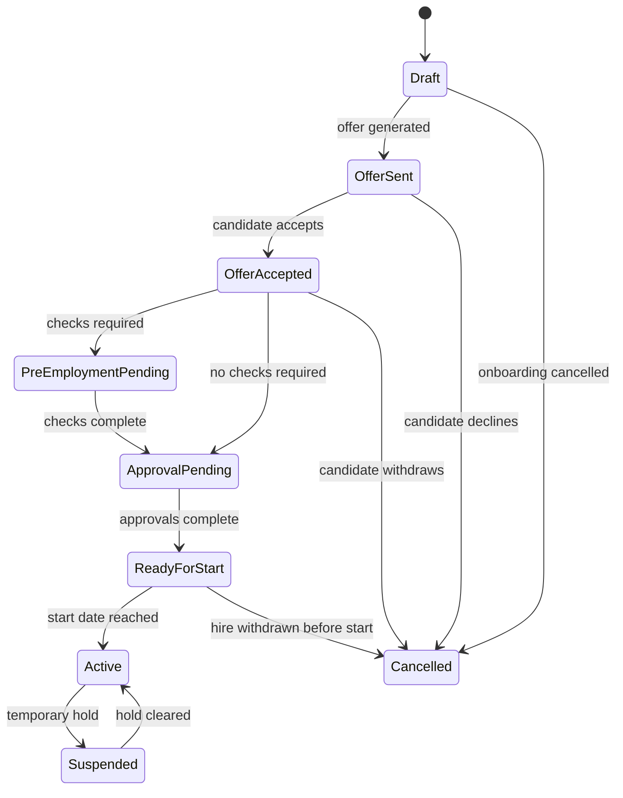

# HRIS Technical Requirements

## Purpose
This document captures implementation-level requirements for the HRIS platform. It complements `docs/hris-system-plan.md`, which stays focused on product and delivery planning.

## Technical Principles
- Build as a modular monolith first.
- Keep bounded contexts clear and independent inside the same codebase.
- Prefer effective-dated history over destructive updates.
- Treat payroll, attendance, approvals, and compliance as auditable workflows.
- Make all tenant, location, department, and employee scope decisions server-enforced.

## Core Modules
- Identity and access control
- Tenant and organization management
- Employee management
- Hiring and onboarding
- Attendance and absence
- Leave management
- Workflow and approvals
- Payroll and statutory calculation
- Tax engine and jurisdiction tables
- Biometric integration
- Reporting and analytics
- Audit and compliance
- Notifications and integrations

## Data and Tenancy Requirements
- Use a shared PostgreSQL database with tenant isolation controls.
- Enforce row-level security in the database.
- Store location, department, and assignment history as effective-dated records.
- Keep payroll and audit records append-only where possible.
- Use UUID identifiers for all core entities.
- Store sensitive fields only in encrypted or masked form where needed.

## Employee Lifecycle State Machine
### Hire / Onboarding State Machine

### Onboarding Technical Rules
- A hire case should not create an active employee until the start date is reached.
- Mandatory tasks must be completed or explicitly waived before activation.
- Payroll, attendance, and access provisioning should be initialized from the effective start date.
- Rehired employees should create a new employment spell while preserving historical records.

## Workflow Engine Requirements
### Approval Workflow
- Support templates scoped by tenant, location, department, and request type.
- Support sequential and parallel steps.
- Support conditional activation on request fields.
- Support delegation, escalation, and skip-if-same-approver logic.
- Persist workflow instances and step instances separately from the template.

### Onboarding Workflow
Typical workflow steps:
1. Candidate selected in ATS.
2. Offer accepted.
3. Pre-employment checks completed.
4. Hire case created with compensation and assignment data.
5. Manager, HR, and payroll approvals completed.
6. Employee record activated on the start date.
7. Payroll, attendance, leave, and access systems initialized.
8. Onboarding tasks completed.

## Attendance and Biometric Integration
### Attendance Pipeline
1. Ingest clock event from device or middleware.
2. Normalize into internal `ClockEvent`.
3. Deduplicate using event checksum.
4. Resolve employee mapping.
5. Resolve current location and shift policy.
6. Write attendance record.
7. Run absence and overtime calculations.

### Biometric Adapter Requirements
- Support webhook push, polling, database polling, file-drop, and MQTT-style ingestion.
- Keep raw payloads for audit and replay.
- Keep device-to-employee enrollment mapping.
- Track last sync state and offline buffers.
- Handle idempotency for repeated event batches.

## Payroll Calculation Requirements
- Resolve payroll policy before calculation.
- Calculate base salary, allowances, overtime, bonuses, and deductions.
- Apply attendance deductions and absence impacts.
- Apply statutory contributions.
- Apply jurisdiction-specific tax logic.
- Produce itemized gross, deductions, employer contributions, and net pay.
- Lock payroll results after final approval.

## Tax and Statutory Requirements
- Use jurisdiction-specific calculation engines.
- Store tax tables, brackets, reliefs, and contribution bands with effective dates.
- Support annual updates without code changes.
- Preserve historical tax logic for prior periods.

## API Requirements
- Version APIs by URL path.
- Use consistent JSON error responses.
- Use cursor-based pagination for large lists.
- Generate OpenAPI docs from backend definitions.
- Keep public API boundaries separate from internal service-to-service contracts.

## Security Requirements
- OIDC / OAuth-based authentication.
- MFA for admin, HR, payroll, and security roles.
- Short-lived sessions and secure cookies.
- Fine-grained authorization through RBAC plus ABAC.
- No PII in application logs.
- Encrypt sensitive fields at rest and in transit.
- Use anti-CSRF protections for browser-based sessions.

## Observability Requirements
- Structured logs with request ID, tenant ID, and user context.
- Metrics for API latency, queue depth, payroll batch duration, and error rates.
- Tracing for API calls and background jobs.
- Alerting for payroll failures, attendance ingestion failures, and auth anomalies.

## Deployment Requirements
- Use containerized services with separate build and runtime stages.
- Run migrations before application rollout.
- Use background workers for payroll, reports, notifications, and attendance processing.
- Maintain separate dev, test, staging, and production environments.

## Technical ADR Topics
- Tenancy model
- Policy resolution strategy
- Workflow engine design
- Biometric integration adapter contract
- Payroll calculation order
- Tax table versioning
- Identity provider choice
- Reporting storage strategy

