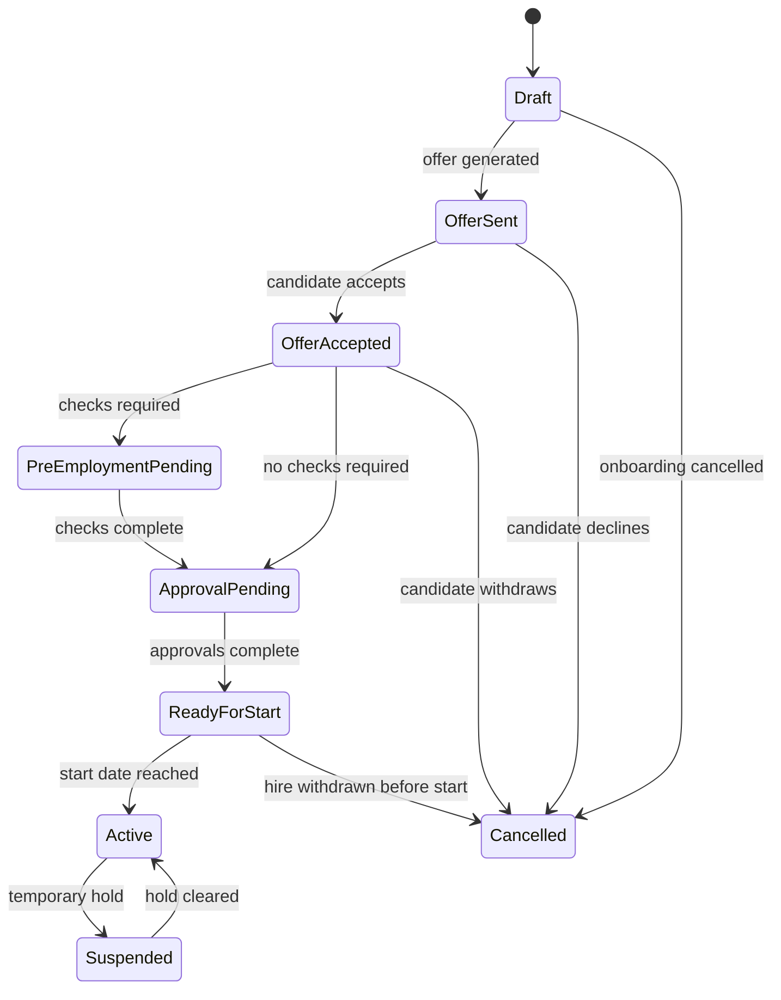
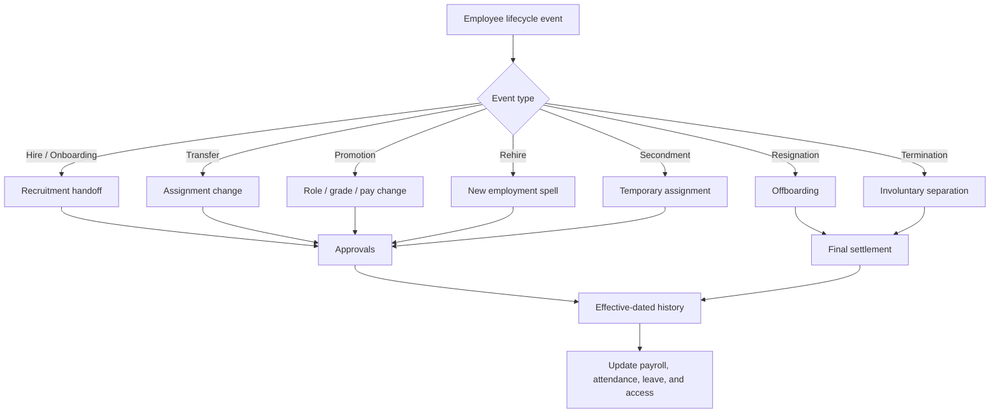
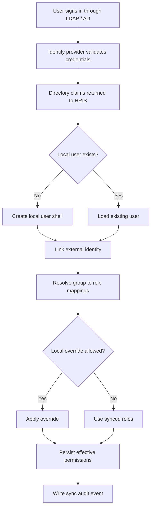
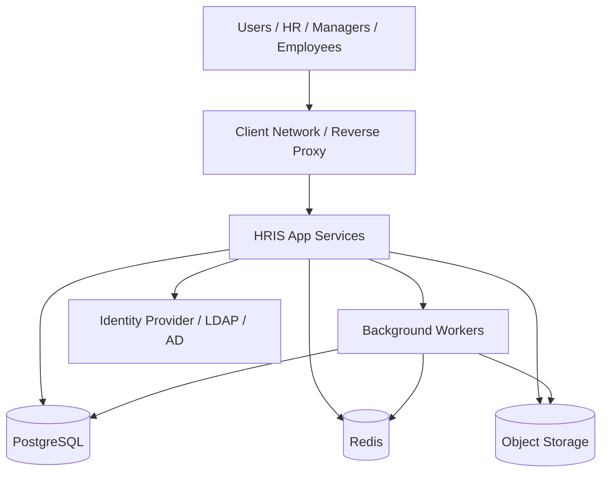
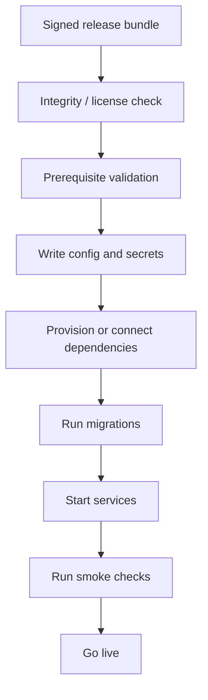

# HRIS Technical Requirements

## Purpose
This document captures implementation-level requirements for the HRIS platform. It complements `docs/hris-system-plan.md`, which stays focused on product and delivery planning.

## Technical Principles
- Build as a modular monolith first.
- Keep bounded contexts clear and independent inside the same codebase.
- Prefer effective-dated history over destructive updates.
- Treat payroll, attendance, approvals, and compliance as auditable workflows.
- Make all tenant, location, department, and employee scope decisions server-enforced.

## Core Modules
- Identity and access control
- Tenant and organization management
- Employee management
- Hiring and onboarding
- Attendance and absence
- Leave management
- Workflow and approvals
- Payroll and statutory calculation
- Tax engine and jurisdiction tables
- Biometric integration
- Reporting and analytics
- Audit and compliance
- Notifications and integrations

## Data and Tenancy Requirements
- Use a shared PostgreSQL database with tenant isolation controls.
- Enforce row-level security in the database.
- Store location, department, and assignment history as effective-dated records.
- Keep payroll and audit records append-only where possible.
- Use UUID identifiers for all core entities.
- Store sensitive fields only in encrypted or masked form where needed.

## Employee Lifecycle State Machine
### Hire / Onboarding State Machine

### Onboarding Technical Rules
- A hire case should not create an active employee until the start date is reached.
- Mandatory tasks must be completed or explicitly waived before activation.
- Payroll, attendance, and access provisioning should be initialized from the effective start date.
- Rehired employees should create a new employment spell while preserving historical records.

### Lifecycle Diagram

### Other Lifecycle Flows
Use the same lifecycle framework for all employment changes, but treat each event type with its own approvals and effective-date handling.

#### Transfer
- Change employee assignment to a new department, location, manager, shift, or cost center.
- Require approvals from source manager, destination manager, and HR when needed.
- Apply the change on an effective date so payroll, attendance, and policies switch cleanly.

#### Promotion
- Update role, grade, title, and compensation in a single effective-dated change.
- Require manager, HR, and payroll approval when pay changes.
- Preserve the previous position and compensation history.

#### Resignation
- Capture employee notice, last working day, and handover requirements.
- Trigger offboarding tasks such as access revocation, asset return, and final settlement.
- Keep the separation record immutable after final approval.

#### Termination
- Support involuntary separation with stricter approval and audit controls.
- Coordinate HR, legal, payroll, and security actions around the effective termination date.
- Immediately revoke access where policy requires it.

#### Rehire
- Create a new employment spell while preserving historical records.
- Reapply onboarding tasks that are still relevant for the return date, role, or location.
- Recalculate policies and payroll eligibility from the rehire effective date.

#### Temporary Assignment / Secondment
- Allow time-bound reassignment to another location, team, or manager.
- Auto-expire the assignment on the configured end date.
- Restore the original assignment automatically unless extended or converted.

### Lifecycle Event Processing Rules
- Every lifecycle event must be effective-dated.
- Historical records must never be rewritten in a way that changes prior payroll or attendance results.
- Lifecycle changes must emit notifications to payroll, attendance, reporting, and approval subsystems.
- Lifecycle transitions should be auditable and reversible only through a new compensating event, not by deleting the original record.

## Workflow Engine Requirements
### Approval Workflow
- Support templates scoped by tenant, location, department, and request type.
- Support sequential and parallel steps.
- Support conditional activation on request fields.
- Support delegation, escalation, and skip-if-same-approver logic.
- Persist workflow instances and step instances separately from the template.

### Onboarding Workflow
Typical workflow steps:
1. Candidate selected in ATS.
2. Offer accepted.
3. Pre-employment checks completed.
4. Hire case created with compensation and assignment data.
5. Manager, HR, and payroll approvals completed.
6. Employee record activated on the start date.
7. Payroll, attendance, leave, and access systems initialized.
8. Onboarding tasks completed.

## Attendance and Biometric Integration
### Attendance Pipeline
1. Ingest clock event from device or middleware.
2. Normalize into internal `ClockEvent`.
3. Deduplicate using event checksum.
4. Resolve employee mapping.
5. Resolve current location and shift policy.
6. Write attendance record.
7. Run absence and overtime calculations.

### Biometric Adapter Requirements
- Support webhook push, polling, database polling, file-drop, and MQTT-style ingestion.
- Keep raw payloads for audit and replay.
- Keep device-to-employee enrollment mapping.
- Track last sync state and offline buffers.
- Handle idempotency for repeated event batches.

## Payroll Calculation Requirements
- Resolve payroll policy before calculation.
- Calculate base salary, allowances, overtime, bonuses, and deductions.
- Apply attendance deductions and absence impacts.
- Apply statutory contributions.
- Apply jurisdiction-specific tax logic.
- Produce itemized gross, deductions, employer contributions, and net pay.
- Lock payroll results after final approval.

## Tax and Statutory Requirements
- Use jurisdiction-specific calculation engines.
- Store tax tables, brackets, reliefs, and contribution bands with effective dates.
- Support annual updates without code changes.
- Preserve historical tax logic for prior periods.

## API Requirements
- Version APIs by URL path.
- Use consistent JSON error responses.
- Use cursor-based pagination for large lists.
- Generate OpenAPI docs from backend definitions.
- Keep public API boundaries separate from internal service-to-service contracts.

## Security Requirements
- OIDC / OAuth-based authentication.
- MFA for admin, HR, payroll, and security roles.
- Short-lived sessions and secure cookies.
- Fine-grained authorization through RBAC plus ABAC.
- No PII in application logs.
- Encrypt sensitive fields at rest and in transit.
- Use anti-CSRF protections for browser-based sessions.

## Directory Integration
The HRIS should support enterprise directories such as LDAP or Active Directory through the identity layer, preferably via an identity provider like Keycloak or an equivalent broker.

### Integration Goals
- Authenticate users against the company directory.
- Sync users, groups, and attributes into the HRIS.
- Map directory groups to application roles and permissions.
- Support just-in-time user creation on first login or scheduled provisioning sync.
- Keep the HRIS as the source of truth for HR-specific data such as employee status, location assignment, payroll, and approvals.

### Recommended Sync Model
- Directory remains the source of truth for login credentials and basic identity attributes.
- HRIS remains the source of truth for HR lifecycle, employee profile, assignment, payroll, and approval data.
- Use an external identity reference on the user record to link the HRIS account to the directory account.
- Sync group membership into roles or permission bundles, but allow local overrides where HR policy requires it.
- Avoid storing passwords in the HRIS when directory authentication is enabled.
- Support both just-in-time provisioning and scheduled sync jobs.
- Track whether access was granted from directory membership, local admin action, or a manual override.

### Recommended Directory Mapping Data
- `external_identity_accounts`
- `external_identity_groups`
- `external_role_mappings`
- `directory_sync_runs`
- `directory_sync_errors`
- `directory_sync_assignments`
- `user_role_assignments`
- `user_permission_overrides`
- `provisioning_events`

### Directory Data Model
Recommended tables for directory integration:

- `identity_providers`
  - Stores directory/provider metadata such as name, tenant scope, protocol, and status.
- `external_identity_accounts`
  - Links an HRIS user to a directory subject, including provider ID, external subject ID, username, and sync state.
- `external_identity_groups`
  - Tracks directory groups and their external identifiers.
- `external_group_memberships`
  - Records which external identity belongs to which external group.
- `external_role_mappings`
  - Maps directory groups to HRIS roles, permission bundles, or scoped access rules.
- `directory_sync_runs`
  - Audit trail for scheduled and manual sync executions.
- `directory_sync_assignments`
  - Stores the result of a sync run for a specific user, group, or role assignment.
- `user_role_assignments`
  - Stores effective HRIS roles assigned to a user, regardless of whether they came from sync or local admin action.
- `user_permission_overrides`
  - Stores temporary or policy-approved access exceptions.
- `provisioning_events`
  - Immutable event log for account creation, linkage, disablement, role assignment, and sync errors.

### Typical Sync Flow
1. User authenticates through LDAP/AD via the identity provider.
2. Identity provider returns identity and group claims.
3. HRIS matches or creates the local user record.
4. HRIS links the local user to the external directory identity.
5. HRIS maps groups to tenant roles and permissions.
6. HRIS refreshes user access on subsequent syncs or on login.
7. HRIS records any local override or manual exception in the audit log.

### Directory Provisioning Workflow

### Directory Provisioning Rules
- A person can exist in the HRIS without a directory account if they are pending activation.
- A directory account can exist before an employee is hired, but it should not get HR access until onboarding completes.
- If a directory user is removed from a group, the HRIS should recompute effective permissions on the next sync.
- If a user belongs to multiple groups, the most specific tenant mapping should win, with explicit local overrides taking priority only when allowed by policy.
- If the company uses a directory for authentication, the HRIS should not become the password authority.
- Directory sync should be tenant-aware so different companies can map the same directory group names differently.

### Recommended Provisioning Events
- `ACCOUNT_LINKED`
- `ACCOUNT_CREATED`
- `ACCOUNT_DISABLED`
- `GROUP_SYNCED`
- `ROLE_ASSIGNED`
- `ROLE_REVOKED`
- `OVERRIDE_GRANTED`
- `OVERRIDE_REVOKED`
- `SYNC_FAILED`
- `SYNC_SUCCEEDED`

### Role and Group Mapping Example
Directory group mapping should be configurable per tenant. Example:

| Directory Group | HRIS Role / Permission Bundle | Scope |
| --- | --- | --- |
| `HRIS-HR-ADMIN` | HR Director / HR Admin | Tenant-wide |
| `HRIS-PAYROLL` | Payroll Admin | Tenant-wide |
| `HRIS-PLANT-MY-SEL-MGR` | Plant Manager | Location scoped |
| `HRIS-ATTENDANCE` | Attendance / Shift Admin | Location scoped |
| `HRIS-FINANCE-READ` | Finance / Accountant | Read-only payroll and reports |
| `HRIS-AUDIT` | Auditor / Compliance Officer | Read-only historical access |
| `HRIS-EMPLOYEE` | Employee | Self-service only |

### Mapping Rules
- Directory groups may map to one or more HRIS roles.
- A role may be granted from directory sync, local admin action, or policy override.
- More specific tenant or location mappings should override generic mappings where permitted.
- Conflicting mappings should be resolved deterministically and recorded in sync audit logs.

## Roles and Menu Matrix
The UI menu should be driven by permissions, with roles acting as permission bundles. The backend must still enforce permissions even if a menu is hidden in the UI.

### Recommended Roles
- Platform Super Admin
- Tenant Owner / Company Admin
- HR Director / HR Admin
- Payroll Admin
- Attendance / Shift Admin
- Plant Manager
- Department Manager / Team Lead
- Recruiter
- Learning Admin
- Finance / Accountant
- Auditor / Compliance Officer
- Employee
- Integration Admin
- Service Account / API User

### Recommended Top-Level Menu Groups
- Dashboard
- People
- Organization
- Attendance
- Leave
- Approvals
- Payroll
- Performance
- Recruitment
- Learning
- Reports
- Integrations
- Audit
- Admin / Settings

### Lifecycle Menu Placement
Lifecycle actions should live under the `People` area, with separate submenus for HR/manager actions and employee self-service.

Recommended placement:
- `People > Employee Lifecycle`
  - Transfer
  - Promotion
  - Rehire
  - Resignation
  - Termination
  - Secondment
  - View lifecycle history
- `People > Onboarding`
  - New hire cases
  - Pending approvals
  - Onboarding tasks
  - Offer acceptance
- `People > Offboarding`
  - Resignation cases
  - Termination cases
  - Exit checklist
  - Final settlement
- `Self-Service > My Employment`
  - View employment history
  - Request resignation
  - View onboarding status for future start dates
  - View transfer or promotion history

Recommended access:
- HR Director / HR Admin: full access to `People > Employee Lifecycle`, `People > Onboarding`, and `People > Offboarding`.
- Plant Manager: access to lifecycle actions for their scope, especially transfer and promotion requests.
- Department Manager / Team Lead: access to scoped transfer, promotion recommendation, and resignation acknowledgment screens.
  - Employee: self-service read-only history plus resignation request if policy allows.
  - Recruiter: onboarding-only access, not transfer/promotion/termination.
  - Payroll Admin: read-only lifecycle views where payroll impact exists.
  - Auditor / Compliance Officer: read-only lifecycle history and audit trail.

### Role-Based Menu Groups
Use the same top-level menu groups across the app, but show each role only the submenus it needs.

#### Platform Super Admin
- Dashboard
- People
  - Employee Lifecycle
  - Onboarding
  - Offboarding
  - Self-Service users
- Organization
  - Tenants
  - Locations
  - Departments
  - Teams
- Attendance
  - Policies
  - Shifts
  - Clock events
- Leave
  - Policies
  - Balances
  - Requests
- Approvals
  - Workflow templates
  - Workflow instances
- Payroll
  - Payroll runs
  - Components
  - Tax settings
- Performance
- Recruitment
  - Requisitions
  - Candidates
- Learning
- Reports
- Integrations
  - Directory sync
  - Biometric devices
  - External webhooks
- Audit
- Admin / Settings
  - Roles and permissions
  - Security
  - System configuration

#### Tenant Owner / Company Admin
- Dashboard
- People
  - Employees
  - Employee Lifecycle
  - Onboarding
  - Offboarding
- Organization
  - Locations
  - Departments
  - Teams
- Attendance
  - Policies
  - Shifts
  - Clock events
- Leave
  - Policies
  - Balances
- Approvals
  - Workflow templates
  - Pending approvals
- Payroll
  - Payroll runs
  - Payslips
  - Payroll settings
- Performance
- Recruitment
- Learning
- Reports
- Integrations
- Audit
- Admin / Settings

#### HR Director / HR Admin
- Dashboard
- People
  - Employees
  - Employee Lifecycle
  - Onboarding
  - Offboarding
  - Self-Service setup
- Organization
  - Locations
  - Departments
  - Teams
- Attendance
  - Policies
  - Shifts
  - Exceptions
- Leave
  - Policies
  - Balances
  - Requests
- Approvals
  - Workflow templates
  - Pending approvals
- Performance
- Recruitment
- Learning
- Reports
- Audit
- Admin / Settings
  - Role assignments
  - Policy settings

#### Payroll Admin
- Dashboard
- People
  - Payroll-relevant employee profiles
- Attendance
  - Attendance inputs
  - Exceptions
- Leave
  - Leave impact checks
- Payroll
  - Payroll runs
  - Payslips
  - Payroll components
  - Tax settings
  - Finalization
- Reports
- Audit
- Admin / Settings
  - Payroll configuration

#### Attendance / Shift Admin
- Dashboard
- People
  - Attendance-relevant employee profiles
- Attendance
  - Clock events
  - Shifts
  - Rosters
  - Attendance policies
- Leave
  - Leave approvals
  - Holiday calendars
- Approvals
  - Attendance approvals
  - Exceptions
- Reports

#### Plant Manager
- Dashboard
- People
  - Team employees
  - Employee Lifecycle requests
  - Onboarding acknowledgements
- Attendance
  - Clock events
  - Shifts
  - Exceptions
- Leave
  - Team leave requests
- Approvals
  - Transfer approvals
  - Promotion approvals
  - Leave approvals
  - Resignation acknowledgements
- Reports

#### Department Manager / Team Lead
- Dashboard
- People
  - Team members
  - Transfer recommendations
  - Promotion recommendations
  - Resignation acknowledgements
- Attendance
  - Team attendance overview
- Leave
  - Team leave requests
- Approvals
  - Team approvals
  - Lifecycle requests in scope
- Reports

#### Recruiter
- Dashboard
- Recruitment
  - Requisitions
  - Candidates
  - Interviews
  - Offers
- People
  - Candidate handoff to onboarding
- Reports

#### Learning Admin
- Dashboard
- Learning
  - Courses
  - Enrollments
  - Certifications
- People
  - Training assignments
- Reports

#### Finance / Accountant
- Dashboard
- Payroll
  - Payroll runs read-only
  - Payslips read-only
  - Export files
- Reports
- Audit

#### Auditor / Compliance Officer
- Dashboard
- Reports
- Audit
- People
  - Read-only lifecycle history
  - Read-only separation records

#### Employee
- Dashboard
- People
  - My Profile
  - My Employment
  - My Lifecycle History
- Attendance
  - My Attendance
- Leave
  - My Leave
- Approvals
  - My Pending Approvals
- Payroll
  - My Payslips
- Learning
  - My Courses
- Reports

#### Integration Admin
- Dashboard
- Integrations
  - Directory sync
  - Biometric devices
  - Webhooks
  - API clients
- People
  - Device enrollments
- Audit

#### Service Account / API User
- No UI menu by default
- API-only access with scoped permissions

### Menu Access Guidance
- Platform Super Admin: all menus.
- Tenant Owner / Company Admin: all tenant-level menus except platform-only controls.
- HR Director / HR Admin: People, Organization, Attendance, Leave, Approvals, Performance, Reports, Audit, Admin / Settings.
- Payroll Admin: Payroll, Attendance, Leave, Reports, Audit, payroll-related settings.
- Attendance / Shift Admin: Attendance, Leave, Approvals, Reports.
- Plant Manager: People, Attendance, Leave, Approvals, Reports.
- Department Manager / Team Lead: team-scoped People, Attendance, Leave, Approvals, Reports.
- Recruiter: Recruitment, candidate-related People views, Reports.
- Learning Admin: Learning, enrollments, Reports.
- Finance / Accountant: Payroll read-only, Reports, Audit, export views.
- Auditor / Compliance Officer: Reports, Audit, read-only historical access.
- Employee: self-service People, Attendance history, Leave, Approvals assigned to self, Payroll slips, Learning.
- Integration Admin: Integrations, device management, logs, Audit.
- Service Account / API User: API-only access, no UI menu by default.

### Menu Rules
- Hide menus the role cannot use.
- Disable actions the role cannot perform.
- Scope data by tenant, location, department, or reporting line.
- Do not rely on the frontend alone for authorization decisions.

## Observability Requirements
- Structured logs with request ID, tenant ID, and user context.
- Metrics for API latency, queue depth, payroll batch duration, and error rates.
- Tracing for API calls and background jobs.
- Alerting for payroll failures, attendance ingestion failures, and auth anomalies.

## Deployment Requirements
- Use containerized services with separate build and runtime stages.
- Run migrations before application rollout.
- Use background workers for payroll, reports, notifications, and attendance processing.
- Maintain separate dev, test, staging, and production environments.

## Portable / On-Prem Delivery Model
If the product is sold as portable software installed on the client host, the delivery should include compiled runtime artifacts and installation assets only, not source code.

### Recommended Packaging Model
- Ship signed container images or signed binaries as the runtime artifact.
- Ship an installation bundle that contains deployment manifests, scripts, sample configuration, and upgrade instructions.
- Provide a client-hosted deployment option using Docker Compose for smaller installs or Kubernetes/Helm for larger environments.
- Keep application source in the vendor repository only; do not distribute source code in the client package.
- Provide an offline install mode for air-gapped client environments.

### Portable Delivery Contents
- Runtime containers or executable binaries
- Database migration bundle
- Configuration templates
- License file or activation token mechanism
- Backup and restore scripts
- Upgrade / rollback scripts
- Health check and smoke test utilities
- Admin bootstrap credentials workflow

### Runtime Characteristics
- Client host owns infrastructure, data, backups, and network perimeter.
- Vendor ships versioned releases and update bundles.
- Versioned config files should support environment-specific overrides without code changes.
- Secrets should be injected at install time and never hardcoded into the package.
- Logging, telemetry, and update endpoints should be configurable for on-prem deployments.

### Update Model
- Support patch, minor, and major release bundles.
- Support controlled upgrades with migration prechecks and rollback plans.
- Preserve backward compatibility for config and database migrations where possible.
- Require release signing and integrity verification before installation.
- Document unsupported downgrade paths clearly if the database schema cannot safely roll back.

### Client Delivery Options
- Small client: single-server Docker Compose bundle
- Medium client: multi-container Docker Compose or VM-based bundle
- Large client: Kubernetes/Helm package for client-managed cluster

### Security and Licensing for Portable Delivery
- Use signed artifacts and checksum verification.
- Require license activation or tenant-specific license keys.
- Support tenant-scoped encryption keys if the customer owns the deployment.
- Keep customer data isolated to the client environment and never depend on vendor-hosted source access.

## On-Prem Distribution Architecture
The portable/on-prem product should be delivered as a self-contained installation package that the client can deploy and operate on their own infrastructure.

### Deployment Topology
Recommended baseline topology:
- Reverse proxy or ingress at the edge
- Application service containers or binaries
- Background worker containers
- PostgreSQL database managed by the client or bundled as an optional managed component
- Redis for cache, jobs, and sessions
- Object storage for files and documents
- Identity provider integration for LDAP / AD / SSO
- Optional observability stack for logs, metrics, and traces

### Installer Flow
Recommended installation flow:
1. Customer receives signed release bundle.
2. Customer verifies artifact integrity and license file.
3. Installer validates host prerequisites and network requirements.
4. Installer writes environment-specific config and secrets.
5. Installer creates or connects database, cache, and object storage.
6. Installer applies migrations and seeds bootstrap configuration.
7. Installer starts app and worker services.
8. Installer runs smoke checks and health checks.
9. System is handed over to client operations.

### Licensing Flow
- Use an activation key, license file, or signed token tied to tenant and environment.
- Validate license state at startup and at regular intervals.
- Support grace period behavior if connectivity to the licensing endpoint is unavailable.
- Keep licensing checks separate from the main business database where possible.
- Allow offline license activation for air-gapped installations.

### Update and Rollback Flow
- Ship updates as versioned release bundles.
- Run preflight compatibility checks before upgrade.
- Back up config and database state before applying changes.
- Apply migrations in a controlled order.
- Verify the new version with smoke tests before declaring success.
- Keep a rollback package or documented rollback procedure for failed upgrades.
- Do not promise rollback for destructive schema changes unless explicitly supported.

### Operational Ownership
- Client owns infrastructure, patching, backups, and access control.
- Vendor owns release packaging, signatures, install docs, and update artifacts.
- Support boundaries should be clear for database, identity, storage, and OS-level issues.

## Technical ADR Topics
- Tenancy model
- Policy resolution strategy
- Workflow engine design
- Biometric integration adapter contract
- Payroll calculation order
- Tax table versioning
- Identity provider choice
- Reporting storage strategy
